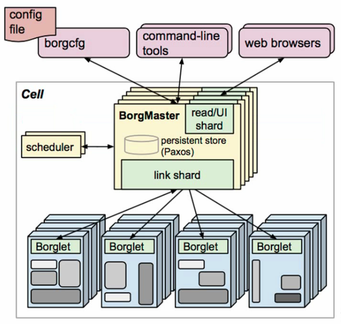
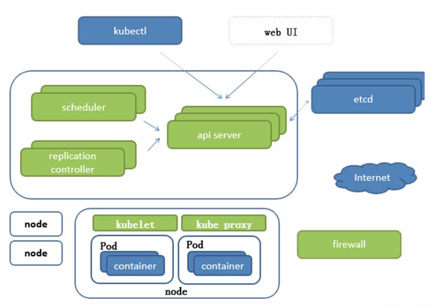
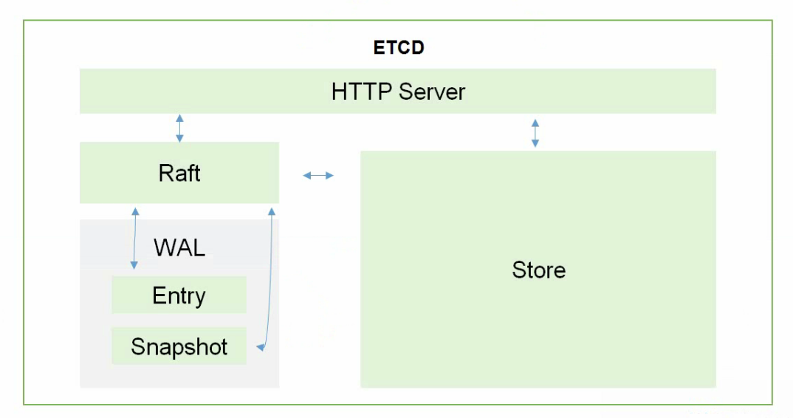

## 一、组件

**服务分类**

* 有状态服务：DBMS
* 无状态服务：LVS、APACHE

**高可用集群副本数量最好为 >= 3（`奇数`）**

### 1.1 Borg

> Borg 架构图

### 1.2 K8S

> K8S 架构图

> ETCD 架构图

> K8S 架构内容介绍

* **核心**

  Api Server：所有服务访问统一入口

  Controller Manager：维护副本的期望数目

  Scheduler：负责接收任务，选择合适的节点进行分配任务

  Etcd：键值对数据库，存储k8s集群所有重要信息（`持久化`）

  Kubelet：直接与容器引交互，实现容器的生命周期管理

  Kube Proxy：负责写入规则至 IPtables、IPVS 实现服务映射访问

* **其他插件**

  CoreDns：为集群中的SVC创建一个域名IP对应的关系解析

  Dashborad：给k8s集群提供一个B/S结构访问体系

  Ingress Controller：官方只能实现四层代理，Ingress可以实现七层代理

  Fedetation：提供一个可以跨集群中心多k8s统一管理功能

  Prometheus：提供k8s集群的监控能力

  Elk：提供k8s集群日志统一分析介入平台