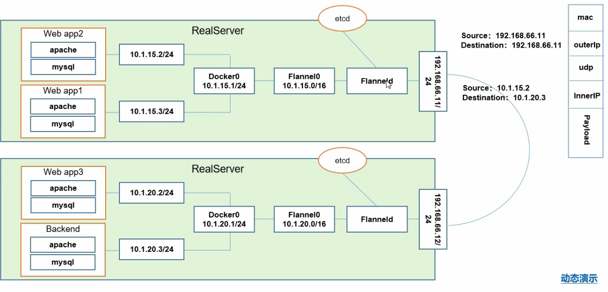
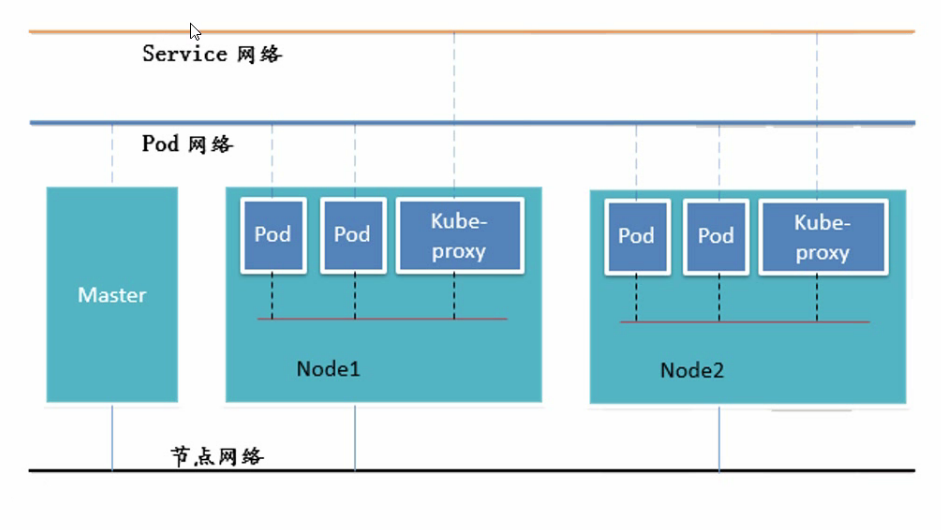

## 二、Pod

### 2.1 Pod概念

**Pod分为两种：`自主式Pod(不是被控制管理的Pod)` 与 `控制器管理的Pod`**

> 控制管理器
* ReplicationController
* ReplicationSet: 相较于 ReplicationController 来说，支持集合式的 selector
* Deployment: 相较于 ReplicationSet 来说，支持rolling-update
* Horizontal Pod Autoscaling: 支持根据Pod的CPU李永利扩缩容，根据内存和用户自定义的metric扩缩容
* StatefulSet: 为了解决有状态服务的问题（Deployments 和 ReplicaSets 是为无状态服务而设计）
 * 稳定的持久化存储
 * 稳定的网络标志
 * 有序部署
 * 有序收缩，有序删除
* DaemonSet: 确保全部（或者一些）Node上运行一个Pod副本。当有Node加入集群时，也会为他们新增一个Pod，删除则也类似。如果删除DaemonSet将会删除它创建的所有Pod
* Job，Cronjob: 负责批处理任务，即仅执行一次的任务，它保证批处理任务的一个或多个 Pod 成功结束
* Cron Job: 管理基于时间的Job，即 1. 在给定时间点只运行一次；2. 周期性地在给定时间点运行

> 服务发现

### 2.2 网络通讯方式

Kubernetes的网络模型假定了所有 Pod 都在一个可以直接连通的扁平的网络空间中，这在 GCE(Google Compute Engine)里面是现成的网络模型，Keburnetes假定这个网络已经存在。

而在私有云里搭建 Kubernetes 集群，就不能假定这个网络已经存在了。我们需要自己实现这个网络假设，将不同节点上的 Docker 容器之间的相互访问先打通，然后运行 Kubernetes。

同一个 Pod 内的多个容器之间：lo
各个 Pod 之间的通讯：Overlay Network
Pod 与 Service 之间的通讯：各节点的 IPtables、LVS 规则

#### 2.2.1 网络解决方案 Kubernetes + Flannel

Flannel是Core0S 团队针对Kubernetes 设计的一-个网络规划服务，简单来说，它的功能是让集群中的不同节点主机创建的Docker容器都具有全集群唯一的虚拟IP地址。而且它还能在这些IP地址之间建立一二个覆盖网络(OverlayNetwork)，通过这个覆盖网络，将数据包原封不动地传递到目标容器内。

> ETCD 之 Flannel 提供说明

* 存储管理Flannel 可分配的IP地址段资源
* 监控ETCD中每个Pod的实际地址，并在内存中建立维护Pod 节点路由表

#### 2.2.2 不同情况下网络通信方式

**同一个Pod内部通讯**

同一个Pod共享同-一个网络命名空间，共享同-一个Linux协议栈

**Pod1至Pod2**

* Pod1 与Pod2 不在同- -台主机，Pod的地址是与docker0在同-一个网段的，但docker0网段 与宿主机网卡是两个完全不同的IP网段，并且不同Node之间的通信只能通过宿主机的物理网卡进行。将Pod的IP和所在Node的IP关联起来，通过这个关联让Pod可以互相访问
* Pod1与Pod2在同一一台机器，由Docker0 网桥直接转发请求至Pod2, 不需要经过Flannel

**Pod至Service的网络**

目前基于性能考虑，全部为LVS 维护和转发

**Pod到外网**

Pod 向外网发送请求，查找路由表，转发数据包到宿主机的网卡，宿主网卡完成路由选择后，iptables执行Masquerade,把源IP更改为宿主网卡的IP，然后向外网服务器发送请求

**外网访问Pod:**

Service

#### 2.2.3 组件通信

> 组件通信示意图

