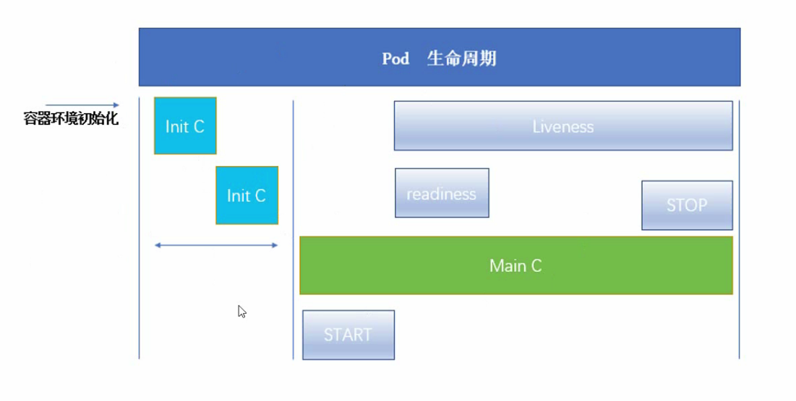
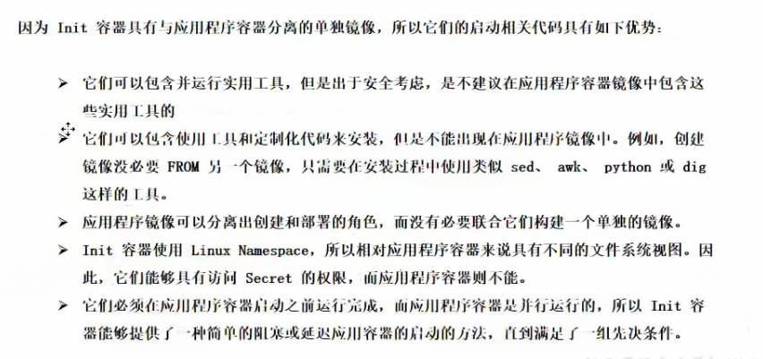

## **四**、Kubernetes 资源清单


### 4.1 K8S中的资源

> 集群资源分类

* 名称空间级别

  * 工作负载型资源（workload）：Pod、ReplicaSet、Deployment、StatefulSet、DaemonSet、Job、CronJob...
  * 服务发现及负载均衡型（ServiceDiscovery LoadBalance）：Service、Ingress...
  * 配置与存储型资源：Volumn（存储卷）、CSI（容器存储接口，可以扩展各种各样的第三方存储卷）
  * 特殊类型的存储卷：ConfigMap（当配置中心来使用的资源类型）、Secret（保存敏感数据）、DownwardAPI（把外部环境中的信息输出给容器）

* 集群级别

  Namespace、Node、Role、ClusterRole、RoleBinding、ClusterRoleBinding

* 元数据型

  HPA、PodTemplate、LimitRange


> 什么是资源

K8S 中所有内容都抽象为资源，资源实例化之后叫对象


### 4.2 资源清单

在 K8S 中，一般使用 yaml 格式的文件来创建符合我们预期期望的 pod，这样的 yaml 文件我们一般称为资源清单


### 4.3 常用字段解释说明

| 参数名                            | 字段类型 | 说明                                                         |
| --------------------------------- | -------- | ------------------------------------------------------------ |
| apiVersion                        | String   | 这里指的是 K8S API的版本，目前基本上是v1，可以用kubectl api-versions命令查询 |
| kind                              | String   | 这里指的是 yaml 文件定义的资源类型与角色，比如：Pod          |
| metadata                          | Object   | 元数据对象，固定值就写metadata                               |
| metadata.name                     | String   | 元数据对象的名字，这里由我们编写，比如命名的Pod名字          |
| metadata.namespace                | String   | 元数据对象的命名空间，由我们自身定义                         |
| Spec                              | Object   | 详细定义对象，固定值就写Spec                                 |
| spec.container[]                  | List     | 这里是Spec对象的容器列表定义，是个列表                       |
| spec.containers[].name            | String   | 这里定义容器的名字                                           |
| spec.containers[].image           | String   | 这里定义要用到的镜像名称                                     |
| spec.containers[].imagePullPolicy | String   | 定义镜像拉取策略，有Always、Never、IfNotPresent三个值可选。<br />（1）Always：表示每次都尝试重新拉取镜像。<br />（2）Never：表示仅使用本地镜像。<br />（3）IfNotPresent：表示如果本地有镜像就是用本地镜像，没有就拉取在线镜像。<br />   默认值为 Always |
| spec.containers[].command[]       | List     | 指定容器启动命令，因为是数组，可以指定多个，不指定则使用镜像打包时使用的启动命令。 |
| spec.containers[].args[]          | List     | 指定容器启动命令参数，因为数组可以指定多个                   |
| spec.containers[].workingDir      | String   | 指定容器的工作目录                                           |
| ...待补充                         |          |                                                              |

```shell
kubectl explain pod

# 输出指定的一个/多个资源的详细信息
kubectl descript pod pod名

# 输出pod中 具体容器的日志
kubectl logs pod名 -c 容器名
```


### 4.4 容器生命周期




#### 4.4.1 Init 容器

> Init 容器

Pod 能够具有多个容器，应用运行在容器里面，但是它也可能有一个或多个先于应用容器启动的 Init 容器

Init 容器与普通容器非常像，除了如下两点：

* Init 容器总是运行到成功完成为止
* 每个 Init 容器都必须在下一个 Init 容器启动之前成功完成

如果 Pod 的 Init 容器失败，Kubernetes 会不断地重启该 Pod，直到 Init 容器成功为止。然而，如果 Pod 对应的 restartPolicy 为 Never，他不会重写启动。


> Init 容器的作用




```shell
kubectl delete deployment --all
kubectl delete pod --all
kubectl delete svc xxx
```


> 利用initC容器完成阻塞操作

```shell
kubectl create -f init_pod.yaml # 初始化pod myapp-pod
kubectl get pod myapp-pod # 查看pod myapp-pod 的情况

kubectl create -f init_service.yaml # 初始化svc myservice
kubectl get pod myapp-pod # 查看pod myapp-pod 的情况

kubectl create -f init_db.yaml # 初始化svc mydb
kubectl get pod myapp-pod # 查看pod myapp-pod 的情况

# 发现pod容器正常启动
```

> init_pod.yaml - 模板

```shell
apiVersion: v1
kind: Pod
metadata:
  name: myapp-pod
  labels:
    app: myapp
spec:
  containers:
  - name: myapp-container
    image: busybox
    command: ['sh', '-c', 'echo The app is running! && sleep 3600']
  initContainers:
  - name: init-myservice
    image: busybox
    command: ['sh', '-c', 'until nslookup myservice; do echo waiting for myservice; sleep 2; done;']
  - name: init-mydb
    image: busybox
    command: ['sh', '-c', 'until nslookup mydb; do echo waiting for mydb; sleep 2; done;']
```

> init_service.yaml - 模板

```shell
kind: Service
apiVersion: v1
metadata:
  name: myservice
spec:
  ports:
    - protocol: TCP
      port: 80
      targetPort: 9376
```

> init_db.yaml - 模板

```shell
kind: Service
apiVersion: v1
metadata:
  name: mydb
spec:
  ports:
    - protocol: TCP
      port: 80
      targetPort: 9377
```


#### 4.4.2 特殊说明

* 在 Pod 启动过程中，`Init容器`会按顺序在网络和数据卷初始化之后启动，每个容器必须在下一个容器启动之前成功退出
* 如果由于运行时或失败退出，将导致容器启动失败，它会根据 Pod 的 RestartPolicy 指定的策略进行重试，然而，如果 Pod 的 RestartPolicy 设置为 Always，`Init容器`失败时会使用 RestartPolicy 策略
* 在所有的`Init容器`没有成功之前，Pod 将不会变成 `Ready状态`。`Init容器`的端口将不会在 Service 中进行聚集。正在初始化中的 Pod 处于 `Pending状态`，但应该会将 `Initializing状态`设置为true
* 如果 Pod 重启，所有`Init容器`必须重新执行
* 对`Init容器` spec 的修改被限制在容器 image 字段，修改其他字段都不会生效。更改`Init容器`的 image 字段，等价于重启该 Pod
* `Init容器`具有应用容器的所有字段，除了 readinessProbe，因为`Init容器`无法定义不用于完成（completion）的就绪（readiness）之外的其他状态，这会在验证过程中强制执行
* 在 Pod 中的每个 app 和 `Init容器`的名字必须唯一，与任何其他容器共享同一个名称，会在验证时抛出错误


#### 4.4.3 探针

> 容器探针


探针是由kubelet对容器执行的定期诊断。要执行诊断，kubelet 调用由容器实现的Handler. 有种类型的处理程序:

* ExecAction: 在容器内执行指定命令。如果命令退出时返回码为0则认为诊断成功。
* TCPSocketAction: 对指定端口上的容器的IP地址进行TCP检查。如果端口打开，则诊断被认为是成功的。
* HTTPGetAction: 对指定的端口和路径上的容器的IP地址执行HTTP Get请求。如果响应的状态大于等于200且小于400, 则诊断被认为是成功的

每次探测都将获得以下三种结果之一 :

* 成功:容器通过了诊断。
* 失败:容器未通过诊断。
* 未知:诊断失败，因此不会果取任何行动。


> 探测方式

livenessProbe: 指示容器是否正在运行。如果`存活探测`失败，则kubelet 会杀死容器，并且容器将受到其重启策略的影响。如果容器不提供存活探针，则默认状态为Success

readinessProbe: 指示容器是否准备好服务请求。如果`就绪探测`失败，端点控制器将从与Pod匹配的所有Service 的端点中删除该Pod的IP地址。初始延迟之前的就绪状态默认为Failure. 如果容器不提供就绪探针，则默认状态为Success


> 就绪检测

**readinessProbe-httpget**

```yaml
apiVersion: v1
kind: Pod
metadata:
  name: readiness-httpget-pod
  namespace: default
spec:
  containers:
  - name: readiness-httpget-container
    image: hub.yyq.com/library/myapp:v1
    imagePullPolicy: IfNotPresent
    readinessProbe:
      httpGet:
        port: 80
        path: /index1.html
      initialDelaySeconds: 1
      periodSeconds: 3
```


> 存活检测

**livenessProbe-exec**

```yaml
apiVersion: v1
kind: Pod
metadata:
  name: liveness-exec-pod
  namespace: default
spec:
  containers:
  - name: liveness-exec-container
    image: busybox
    imagePullPolicy: IfNotPresent
    command: ["/bin/sh", "-c", "touch /tmp/live; sleep 60; rm -rf /tmp/live; sleep 3600"]
    livenessProbe:
      exec:
        command: ["test", "-e", "/tmp/live"]
      initialDelaySeconds: 1
      periodSeconds: 3
```


**livenessProbe-httpget**

```yaml
apiVersion: v1
kind: Pod
metadata:
  name: liveness-httpget-pod
  namespace: default
spec:
  containers:
  - name: liveness-httpget-container
    image: hub.yyq.com/library/myapp:v1
    imagePullPolicy: IfNotPresent
    ports:
    - name: http
      containerPort: 80
    livenessProbe:
      httpGet:
        port: http
        path: /index.html
      initialDelaySeconds: 1
      periodSeconds: 3
      timeoutSeconds: 10
```


**livenessProbe-tcp**

```yaml
apiVersion: v1
kind: Pod
metadata:
  name: liveness-tcp-pod
  namespace: default
spec:
  containers:
  - name: liveness-tcp-container
    image: hub.yyq.com/library/myapp:v1
    imagePullPolicy: IfNotPresent
    livenessProbe:
      initialDelaySeconds: 5
      timeoutSeconds: 1
      tcpSocket:
        port: 80
      periodSeconds: 3
```


**readiness-liveness**

```yaml
apiVersion: v1
kind: Pod
metadata:
  name: readiness-liveness-pod
  namespace: default
spec:
  containers:
  - name: readiness-liveness-container
    image: hub.yyq.com/library/myapp:v1
    imagePullPolicy: IfNotPresent
    ports:
    - name: http
      containerPort: 80
    readinessProbe:
      httpGet:
        port: 80
        path: /index1.html
      initialDelaySeconds: 1
      periodSeconds: 3
    livenessProbe:
      httpGet:
        port: http
        path: /index.html
      initialDelaySeconds: 1
      periodSeconds: 3
      timeoutSeconds: 10
```


#### 4.4.4 启动、退出

`postStart` 与 `preStop`

```yaml
apiVersion: v1
kind: Pod
metadata:
  name: lifecycle-pod
spec:
  containers:
  - name: lifecycle-container
    image: hub.yyq.com/library/myapp:v1
    lifecycle:
      postStart:
        exec:
          command: ["/bin/sh", "-c", "echo Hello from postStart handler > /usr/share/message"]
      preStop:
        exec:
          command: ["/bin/sh", "-c", "echo Hello from preStop handler > /usr/share/message"]
```


#### 4.4.5 Pod phase 可能存在的值

* 挂起(Pending) : Pod 已被Kubernetes 系统接受，但有一一个或者多个容器镜像尚未创建。等待时间包括调度Pod的时间和通过网络下载镜像的时间，这可能需要花点时间

* 运行中(Running) :该Pod已经绑定到了一个节点上，Pod中所有的容器都已被创建。至少有一一个容器正在运行，或者正处于启动或重启状态

* 成功(Succeeded) : Pod中的所有容器都被成功终止，并且不会再重启

* 失败(Failed) : Pod中的所有容器都已终止了，并且至少有一个容器是因为失败终止。也就是说，容器以非0状态退出或者被系统终止

* 未知(Unknown) :因为某些原因无法取得Pod 的状态，通常是因为与Pod所在主机通信失败
