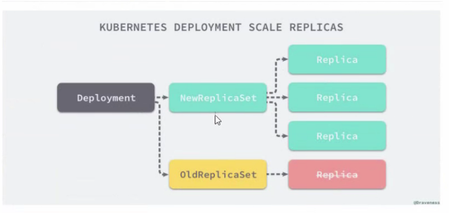

## 五、资源控制器

Pod分类

* 自主式Pod：Pod推出了，此类型的Pod不会被创建
* 控制器管理的Pod：在控制器的生命周期中，始终要维持Pod的副本数目


> 注意点

声明式编程最优方案 `apply`

命令式编程最优方案 `create`


### 5.1  什么是控制器

Kubernetes中内建了很多controller (控制器) ,这些相当于一个状态机，用来控制Pod的具体状态和行为


### 5.2 控制器类型

* `ReplicationController` 和 `ReplicaSet`
* `Deployment`
* `DaemonSet`
* `StateFulSet`
* `Job/CronJjob`
* `Horizontal Pod Autoscaling`


### 5.3 ReplicationController 和 ReplicaSet

ReplicationController (RC)用来确保容器应用的副本数始终保持在用户定义的副本数。即如果有容器异常退出，会自动创建新的Pod来替代;而如果异常多出来的容器也会自动回收;

在新版本的Kubernetes中建议使用ReplicaSet来取代ReplicationController。ReplicaSet 跟 ReplicationController没有本质的不同,只是名字不一一样,并且ReplicaSet支持集合式的selector;


> RS 与 RC 与 Deployment 关联

RC (ReplicationController )主要的作用就是用来确保容器应用的副本数始终保持在用户定义的副本数。即如果有容器异常退出，会自动创建新的Pod来替代;而如果异常多出来的容器也会自动回收

Kubernetes 官方建议使用RS (ReplicaSet) 替代RC (ReplicationController )进行部署， RS跟RC没有本质的不同，只是名字不-样,并诅RS支持集合式的selector

```yaml
apiVersion: extensions/v1beta1
kind: ReplicaSet
metadata:
  name: frontend
spec:
  replicas: 3
  selector:
    matchLabels: # 匹配标签
      tier: frontend
  template:
    metadata:
      labels:
        tier: frontend
    spec:
      containers:
      - name: php-redis
        image: hub.yyq.com/library/myapp:v1
        env:
        - name: GET_HOSTS_FROM
          value: dns
        ports:
        - containerPort: 80
```

```shell
cd /home && mkdir rs && cd rs && vim rs.yaml # 创建文件

kubectl create -f rs.yaml # 生成rs
kubectl get pod --show-labels # 查看pod与label
kubectl label pod `pod名` `key=value` --overwrite=true # 修改pod的label
```

 

> RS 与 Deployment 的关联




### 5.4 Deployment

Deployment为Pod和ReplicaSet提供了-个声明式定义(declarative)方法，用来替代以前的ReplicationController来方便的管理应用。典型的应用场景包括;

* 定义Deployment来创建Pod和ReplicaSet
* 滚动升级和回滚应用
* 扩容和缩容
* 暂停和继续 Deployment


> 案例：部署一个简单的 Nginx 应用

```yaml
apiVersion: extensions/v1beta1
kind: Deployment
metadata:
  name: nginx-deployment
spec:
  replicas: 3
  template:
    metadata:
      labels:
        app: nginx
    spec:
      containers:
      - name: nginx
        image: hub.yyq.com/library/myapp:v1
        ports:
        - containerPort: 80  
```

```shell
kubectl apply -f deployment.yaml --record # --record 记录启动步骤
kubectl get deployment nginx-deployment # 查看deployment
kubectl get rs # 查看rs

kubectl get pod nginx-deployment # 查看pod pod名字: deployment名字-rs的md5随机值-pod的md5随机值
kubectl get pod -o wide # 查看pod节点与内网ip

kubectl scale deployment nginx-deployment --replicas=副本数量 # 扩缩容deployment

kubectl set image deployment nginx-deployment nginx=新镜像地址 # 修改deployment中容器的镜像地址

kubectl rollout undo deployment nginx-deployment # 回滚
kubectl rollout undo deployment nginx-deployment --to-revision=2 # 回滚到指定版本
kubectl rollout pause deployment nginx-deployment # 暂停回滚
kubectl rollout status deployment nginx-deployment # 查看回滚状态
kubectl rollout history deployment nginx-deployment # 查看回滚记录

```


> Deployment 更新策略

Deployment可以保证在升级时只有一定数量的Pod是down的。默认的，它会确保至少有比期望的Pod数量少-个是up状态(最多一个不可用)

Deployment同时也可以确保只创建出超过期望数量的一定数量的Pod。默认的，它会确保最多比期望的Pod数量多-个的Pod是up的(最多1个surge )

未来的Kuberentes版本中，将从1-1变成25%-25%

```shell
$ kubectl describe deployments
```


> Rollover（多个rollout并行）

假如您创建了-个有5个`niginx:1.7.9`replica的Deployment, 但是当还只有3个`nginx:1.7.9`的replica创建出来的时候您就开始更新含有5个` nginx:1.9.1` replica 的Deployment。在这种情况下，Deployment 会立即杀掉已创建的3个“nginx:1.7.9、 的Pod,开始创建`nginx:1.9.1` 的Pod.它不会等到所有的5个`nginx:1.7.9`的Pod都创建完成后才开始改变航道


> 清理Policy

您可以通过设置`.spec .revi sonHistorylimit`项来指定 deployment最多保留多少revision历史记录。默认的会保留所有的revision;如果将该项设置为**0**, Deployment 就不允许回退了


### 5.5 DaemonSet

DaemonSet确保全部(或者-些) Node. 上运行一个Pod的副本。当有Node加入集群时，也会为他们新增一个Pod.当有Node从集群移除时，这些Pod也会被回收。删除DaemonSet将会删除它创建的所有Pod使用DaemonSet的一些典型用法:

* 运行集群存储daemon,例如在每个Node上运行`glusterd`、 `ceph`
* 在每个Node.上运行日志收集daemon, 例如`fluentd`、`logstash`
* 在每个Node.上运行监控daemon,例如Prometheus Node Exporter、`collectd` 、Datadog 代理、New Relic代理，或Ganglia `gmond`


> 案例

```yaml
apiVersion: apps/v1
kind: DaemonSet
metadata:
  name: daemonset-example
  labels:
    app: daemonset
spec:
  selector:
    matchLabels:
      name: daemonset-example
  template:
    metadata:
      labels:
        name: daemonset-example
    spec:
      containers:
      - name: daemonset-example
        image: hub.yyq.com/library/myapp:v1
```

```shell
vim daemonset.yaml
kubectl create -f daemonset.yaml
```


### 5.6 Job

Job负责批处理任务,即仅执行-次的任务，它保证批处理任务的一个或多个Pod成功结束


> 特殊说明

* spec.template格式同Pod
* RestartPolicy仅支持Never或OnFailure
* 单个Pod时，默认Pod成功运行后Job即结束
* `.spec.completions`标志Job结束需要成功运行的Pod个数,默认为1
* `.spec.parallelism`标志并行运行的Pod的个数，默认为1
* `spec.activeDeadlineSeconds`标志失败Pod的重试最大时间， 超过这个时间不会继续重试


> 案例

```yaml
apiVersion: batch/v1
kind: Job
metadata:
  name: pi
spec:
  template:
    metadata:
      name: pi
    spec:
      containers:
      - name: pi
        image: perl
        command: ["perl", "-Mbignum=bpi", "-wle", "print bpi(2000)"]
      restartPolicy: Never
```


### 5.7 CronJob

CronJob管理基于时间的Job，即:

* 在给定时间点只运行一次
* 周期性地在给定时间点运行


使用前提条件: 当前使用的Kubernetes集群，版本>= 1.8 (对Cron]ob)。对于先前版本的集群，版本<1.8,启动API Server时，通过传递选项--runtime - config=batch/v2alpha1-true可以开启batch/v2alpha1AP|


典型的用法如下所示:

* 在给定的时间点调度Job运行
* 创建周期性运行的Job, 例如:数据库备份、发送邮件


> CronJob Spec

* spec.template格式同Pod
* RestartPolicy仅支持Never或OnFailure
* 单个Pod时,默认Pod成功运行后Job即结束
* `.spec.completions`标志ob结束需要成功运行的Pod个数,默认为1
* `.spec.parallism`标志并行运行的Pod的个数，默认为1
* `spec.activeDeadlineSeconds`标志失败Pod的重试最大时间，超过这个时间不会继续重试


* `.spec.schedule` :调度，必需宇段,指定任务运行周期，格式同Cron

* `.spec. jobTemplate`: Job模板，必需字段，指定需要运行的任务,格式同Job

* `.spec. startingDeadlineSeconds` :启动Job的期限(秒级别) .该字段是可选的。如果因为任何原因而错过了被调度的时间，那么错过执行时间的Job将被认为是失败的。如果没有指定,则没有期限

* `.spec.concurrencyPolicy`:并发策略,该字段也是可选的。它指定了如何处理被Cron Job创建的Job的并发执行。只允许指定下面策略中的一种:

  * Allow (默认) :允许并发运行Job
  * Forbid:禁止并发运行，如果前一个还没有完成，则直接跳过下一个
  * Replace :取消当前正在运行的Job, 用一个新的来替换

  注意，当前策略只能应用于同-个Cron Job创建的Job。如果存在多个Cron Job,它们创建的Job之间总是允许并发运行。

* `.spec.suspend`:挂起,该宇段也是可选的。如果设置为true, 后续所有执行都会被挂起。它对已经开始执行的Job不起作用。默认值为false 。

* `.spec.successfulJobsHistorylimit`和`.spec.failedJobsHistorylimit`:历史限制，是可选的字段。它们指定了可以保留多少完成和失败的Job。默认情况下，它们分别设置为3和1。设置限制的值为日，相关类型的Job完成后将不会被保留。


> 案例

```yaml
apiVersion: batch/v1beta1
kind: CronJob
metadata:
  name: hello
spec:
  schedule: "*/1 * * * *"
  jobTemplate:
    spec:
      template:
        spec:
          containers:
          - name: hello
            image: busybox
            args:
            - /bin/sh
            - -c
            - date; echo Hello from the Kubernetes cluster
          restartPolicy: OnFailure
```

```shell
vim cronjob.yaml
kubectl create -f cronjob.yaml
kubectl get cronjob
kubectl get job -w
kubectl get pod -w
```


### 5.8 StatefulSet

StatefulSet作为Controller为Pod提供唯一的标识。 它可以保证部署和scale的顺序

StatefulSet是为了解决有状态服务的问题(对应Deployments和ReplicaSets是为无状态服务而设计) , 其应用场景包括:

* 稳定的持久化存储，即Pod重新调度后还是能访问到相同的持久化数据，基于PVC来实现
* 稳定的网络标志，即Pod重新调度后其PodName和HostName不变,基于Headless Service (即没有Cluster IP的Service)来实现
* 有序部署,有扩展，即Pod是有顺序的，在部署或者扩展的时候要依据定义的顺序依次依次进行(即从0到N-1,在下一个Pod运行之前所有之前的Pod必须都是Running和Ready狀态)，基于init containers来实现
* 有序收缩，有序删除(即从N-1到0)


### 5.9 Horizontal Pod Autoscaling

应用的资源使用率通常都有高峰和低谷的时候，如何削峰填谷，提高集群的整体资源利用率,让service中的Pod个数自动调整呢?这就有赖于Horizontal Pod Autoscaling了.顾名思义，使Pod水平自动缩放