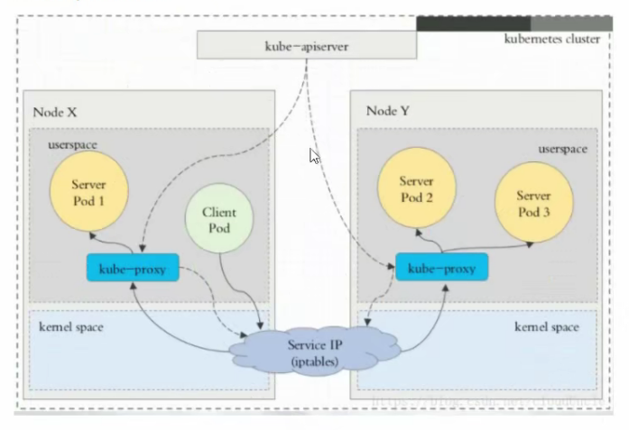

## 六、Service


### 6.1 概念

Kubernetes `Service` 定义了这样一种抽象: 一个`Pod`的逻辑分组, -种可以访问它们的策略--通常称为微服务。这一组`Pod`能够被`Service`访问到，通常是通过`Label Selector`


Service能够提供负载均衡的能力，但是在使用上有以下限制:

* 只提供4层负载均衡能力，而没有7层功能，但有时我们可能需要更多的匹配规则来转发请求,这点上4层.负载均衡是不支持的


### 6.2 Service类型

Service在K8s中有以下四种类型

* Clusterlp: 默认类型，自动分配一个仅Cluster内部可以访问的虚拟IP
* NodePort: 在ClusterlP基础上为Service在每台机器上绑定一 个端口，这样就可以通过<NodeIP>:NodePort来访问该服务
* LoadBalancer: 在NodePort的基础上，借助cloud provider创建一 个外部负载均衡器，并将请求转发到<NodelP>: NodePort
* ExternalName:把集群外部的服务 引入到集群内部来，在集群内部直接使用。没有任何类型代理被创建，这只有kubernetes 1.7或更高版本的kube-dns才支持


#### 6.2.1 ClusterIP

ClusterIP主要在每个node节点使用 iptables，将发向ClusterlP对应端口的数据，转发到kube-proxy中。然后kube-proxy自己内部实现有负载均衡的方法,并可以查询到这个 service 下对应pod的地址和端口，进而把数据转发给对应的pod的地址和端口


为了实现图上的功能，主要需要以下几个组件的协同工作:

* `apiserver` 用户通过kubectl命令向apiserver发送创建service的命令, apiserver接收到请求后将数据存储到etcd中
* `kube-proxy` kubernetes的每个节点中都有一个叫做kube-proxy的进程， 这个进程负责感知service, pod的变化，并将变化的信息写入本地的iptables规则中
* `iptables` 使用NAT等技术将virtuallP的流量转至endpoint中


> 案例实验

1. 创建 myapp-deploy.yaml 文件

   ```yaml
   vim myapp-deploy.yaml
   kubectl apply -f myapp-deploy.yaml
   kubectl get pod -o wide
   
   apiVersion: apps/v1
   kind: Deployment
   metadata:
     name: myapp-deploy
     namespace: default
   spec:
     replicas: 3
     selector:
       matchLabels:
         app: myapp
         release: stabel
     template:
       metadata:
         labels:
           app: myapp
           release: stabel
           env: test
       spec:
         containers:
         - name: myapp
           image: wangyanglinux/myapp:v2
           imagePullPolicy: IfNotPresent
           ports:
           - name: http
             containerPort: 80
   ```

2. 创建 service 信息

   ```yaml
   vim myapp-svc.yaml
   kubectl apply -f myapp-service.yaml
   kubectl get svc
   ipvsadm -Ln # 查看ipvs
   
   apiVersion: v1
   kind: Service
   metadata:
     name: myapp
     namespace: default
   spec:
     type: ClusterIP
     selector:
       app: myapp
       release: stabel
     ports:
     - name: http
       port: 80
       targetPort: 80
   ```


> Headless Service

有时不需要或不想要负载均衡，以及单独的Service IP。遇到这种情况，可以通过指定ClusterIP(spec.clusterIP)的值为"None"来创建Headless Service。这类Service并不会分配ClusterIP，kube-proxy 不会处理它们，而且平台也不会为它们进行负载均衡和路由

```yaml
vim myapp-svc-headless.yaml
kubectl get pod -n kube-system -o wide # 获取到kube-system创建的pod
yum install -y bind-utils # 需要安装依赖
dig -t A myapp-headless.default.svc.cluster.local. @10.244.0.28 # 解析

apiVersion: v1
kind: Service
metadata:
  name: myapp-headless
  namespace: default
spec:
  selector:
    app: myapp
  clusterIP: "None"
  ports:
  - port: 80
    targetPort: 80
```


#### 6.2.2 NodePort

NodePort的原理在于在 node 开一个端口，将向该端口的流量导入到kube-proxy，然后由kube-proxy进-步到给对应的 pod


> 案例

```yaml
vim myapp-svc.yaml
kubectl get svc
iptables -t nat -nvL
ipvsadm -Ln

apiVersion: v1
kind: Service
metadata:
  name: myapp
  namespace: default
spec:
  type: NodePort
  selector:
    app: myapp
    release: stabel
  ports:
  - name: http
    port: 80
    targetPort: 80
```


#### 6.2.3 LoadBalancer

loadBalancer和nodePort实是同一种方式。区别在于loadBalancer比nodePort多了一步,就是可以调用cloud provider去创建LB来向节点导流


#### 6.2.4 ExternalName

这种类型的Service通过返回CNAME和它的值，可以将服务映射到externalName宇段的内容(例如: hub.yyq.com )。ExternalName Service是Service的特例，它没有selector,也没有定义任何的端口和Endpoint.相反的.对于运行在集群外部的服务，它通过返回该外部服务的别名这种方式来提供服务

```yaml
apiVersion: v1
kind: Service
metadata:
  name: my-svc-en
  namespace: default
spec:
  type: ExternalName
  externalName: hub.yyq.com
```

当查询主机my-svc-en.defalut.svc.cluster.local ( SVC_ NAME.NAMESPACE.svc.cluster.local )时，集群的DNS服务将返回一个值hub.yyq.com的CNAME记录。访问这个服务的工作方式和其他的相同,唯-不同的是重定向发生在 DNS层，而且不会进行代理或转发


### 6.3 VIP 和 Service 代理

在Kubernetes集群中，每个Node运行-一个kube - proxy进程。kube proxy负责为Service 实现了一种VIP (虚拟IP)的形式，而不是ExternalName 的形式。在Kubernetes v1.0版本，代理完全在userspace。在Kubernetes v1.1版本，新增了iptables代理,但并不是默认的运行模式。

从Kubernetes v1.2起,默认就是iptables代理。在Kubernetes v1.8.0-beta.0中，添加了ipvs代理

在Kubernetes 1.14版本开始默认使用ipvs代理

在Kubernetes v1.0版本，Service 是“4层”(TCP/UDP over IP)概念。在Kubernetes v1.1版本，新增了Ingress API (beta 版)，用来表示"7层”(HTTP) 服务


**为何不使用round-robin DNS?**


### 6.4 代理模式的分类

#### 6.4.1 userspace 代理模式



#### 6.4.2 iptables 代理模式


#### 6.4.3 ipvs 代理模式

这种模式，kube-proxy 会监视Kubernetes `Service` 对象和`Endpoints`, 调用`netlink`接口以相应地创建ipvs规则并定期与Kubernetes `Service`对象和`Endpoints`对象同步ipvs规则，以确保ipvs状态与期望一致。访问服务时,流量将被重定向到其中一个后端Pod

与iptables类似，ipvs于`netfilter`的hook功能，但使用哈希表作为底层数据结构并在内核空间中工作。这意味着ipvs可以更快地重定向流量,并且在同步代理规则时具有更好的性能。此外，ipvs为负载均衡算法提供了更多选项，例如:

* `rr`: 轮询调度
* `lc`: 最小连接数
* `dh`: 目标哈希
* `sh`: 源哈希
* `sed`: 最短期望延迟
* `nq`: 不排队调度


**注意: ipvs 模式假定在运行kube-proxy 之前在节点上都已经安装了 IPVS内核模块。当kube-proxy 以ipvs 代理模式启动时，kube-proxy 将验证节点上是否安装了IPVS 模块，如果未安装，则kube-proxy将回退到iptables 代理模式**


