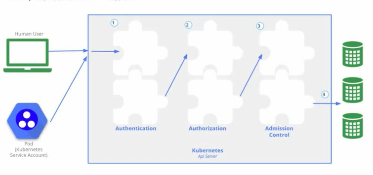
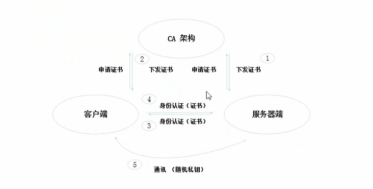
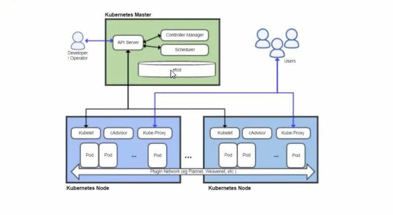
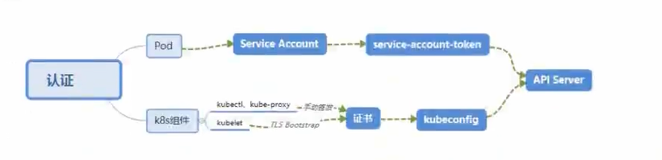
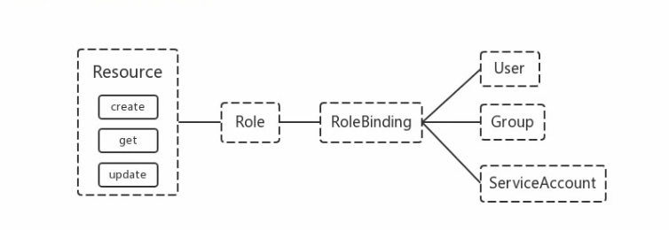

## 九、安全

### 9.1 机制说明

Kubernetes作为-个分布式集群的管理工具，保证集群的安全性是其一个重要的任务。 API Server是集群内部各个组件通信的中介，也是外部控制的入口。所以Kubernetes的安全机制基本就是围绕保护API Server来设计的。Kubernetes 使用了认证(Authentication) 、鉴权(Authorization) 、准入控制(Admission Control)三步来保证API Server的安全




### 9.2 认证 Authentication

* HTTP Token认证:通过一个Token来识别合法用户

  * HTTP Token的认证是用-个很长的特殊编码方式的并且难以被模仿的字符串- Token来表达客户的一种式。Token是一个很长的很复杂的字符串, 每-个Token对应一个用户名存储在 API Server能访问的文件中。当客户端发起API调用请求时，需要在HTTP Header里放入Token

*  HTTP Base认证:通过户名+密码的方式认证
  * 用户名+: +密码用 BASE64 算法进行编码后的字符串放在HTTP Request中的Heather Authorization域里发送给服务端，服务端收到后进行编码，获取用户名及密码

* 最严格的 HTTPS 证书认证:基于CA根证书签名的客户端身份认证方式


> 1、HTTPS 证书认证




> 2、需要认证的节点




**两种类型**

* Kubernetes 组件对API Server的访问: kubectl、Controller Manager、Scheduler、kubelet、kube-proxy
* Kubernetes 管理的Pod对容器的访问: Pod (dashboard 也是以 Pod 形式运行)


**安全性说明**

* Controller Manager、Scheduler 与API Server在同一台机器，所以直接使用API Server的非安全端口访问，`insecure-bind- address=127.0.0.1`
* kubectl、kubelet、kube-proxy 访问API Server就都需要证书进行HTTPS双向认证


**证书颁发**

* 手动签发:通过k8s集群的跟ca进行签发HTTPS证书
* 自动签发: kubelet首次访问API Server时，使用token做认证,通过后，Controller Manager会为kubelet生成一个证书,以后的访问都是用证书做认证了


> 3、kubeconfig

kubeconfig 文件包含集群参数(CA证书API Server地址) ,客户端参数(上面生成的证书和私钥)，集群context信息(集群名称、用户名)。Kubernetes 组件通过启动时指定不同的 kubeconfig 文件可以切换到不同


> 4、ServiceAccount

Pod中的容器访问API Server。因为Pod的创建、销毁是动态的，所以要为它手动生成证书就不可行了。Kubernetes使用了Service Account解决Pod访问API Server的认证问题


> 5、Secret 与 SA 的关系

Kubernetes设计了一种资源对象叫做Secret,分为两类，一种是用于ServiceAccount的service-account-token,另一种是用于保存用户自定义保密信息的Opaque。ServiceAccount 中用到包含三个部分: Token、ca.crt、namespace

* token是使用 API Server私钥签名的JWT。用于访问API Server时，Server端认证
* ca.crt, 根证书。用于Client端验证API Server发送的证书
* namespace,标识这个service-account-token的作用域名空间

<!-- Json web token (JWT) ，是为了在网络应用环境间传递声明而执行的一种基于JSON 的开放标准([(RFC 7519] ) .该token被设计为紧凑且安全的，特别适用于分布式站点的单点登录(sso) 场景。JwT的声明-般被用来在身份提供者和服务提供者间传递被认证的用户身份信息，以便于从资源服务器获取资源,也可以增加一些额外的其它业务逻辑所必须的声明信息，该token 也可直接被用于认证，也可被加密 -->

```shell
kubectl get secret --all-namespaces
kubectl describe secret default-token-5gm9r --namepspace=kube-system
```

默认情况下，每个namespace都会有一个ServiceAccount,如果Pod在创建时没有指定ServiceAccount, 就会使用Pod所属的namespace的ServiceAccount

<!-- 默认挂载目录: / run/secrets/ kubernetes . io/serviceaccount/ -->


> 6、总结




### 9.3 鉴权 Authorization

上面认证过程，只是确认通信的双方都确认了对方是可信的，可以相互通信。而鉴权是确定请求方有哪些资源的权限。API Server目前支持以下几种授权策略(通过 API Server的启动参数"--authorization-mode"设置)

* AlwaysDeny: 表示拒绝所有的请求，-般用于测试

* AlwaysAllow: 允许接收所有请求,如果集群不需要授权流程，则可以采用该策略
* ABAC (Attribute-Based Access Control): 基于属性的访问控制，表示使用用户配置的授权规则对用户请求进行匹配和控制
* Webbook: 通过调用外部REST服务对用户进行授权
* RBAC (Role-Based Access Control): 基于角色的访问控制，现行默认规则


#### 9.3.1 RBAC 授权模式

RBAC (Role-Based Access Control)基于角色的访问控制, 在 Kubernetes 1.5 引入，现行版本成为默认标准。相对其他访问控制方式，拥有一下优势

* 对集群中的资源和非资源均拥有完整的覆盖
* 整个RBAC完全由几个API对象完成，同其它API对象一 样，可以用kubectl或API进行操作
* 可以在运行时进行调整,无需重启API Server


> 1、RBAC的API资源对象说明

RBAC引入了4个新的顶级资源对象: Role、ClusterRole、RoleBinding、ClusterRoleBinding, 4种对象类型均可以通过kubectl与API操作。

Role、RoleBinding是命名空间资源，ClusterRole、ClusterRoleBinding是集群级别资源。



需要注意的是Kubernetes并不会提供用户管理，那么User、Group、ServiceAccount 指定的用户又是从哪里来的呢? Kubernetes 组件(kubectl. kube-proxy) 或是其他自定义的用户在向CA申请证书时,需要提供一个证书请求文件

```json
{
    "CN": "admin",
    "hosts": [],
    "key": {
        "algo": "rsa",
        "size": 2048
    },
    "name": [
        {
            "C": "CN",
            "ST": "Goo",
            "L": "XS",
            "O": "system:masters",
            "OU": "System"
        }
    ]
}
```

API Server会把客户端证书的`CN`字段作为User,把`names.o`字段作为Group

kubelet使用 TLS Bootstaping 认证时，API Server可以使用Bootstrap Tokens或者Token authentication file验证=token, 无论哪一种，Kubernetes 都会为token绑定一个默认的User和Group

Pod使用ServiceAccount认证时，service-account-token 中的JWT会保存User信息有了用户信息，再创建一对角色/角色绑定(集群角色/集群角色绑定)资源对象，就可以完成权限绑定了


#### 9.3.2 角色(Role) 和 集群角色（ClusterRole）

在RBAC API中，Role 表示组规则权限， 权限只会增加(累加权限)，不存在一个资源-开始就有很多 权限而通过RBAC对其进行减少的操作: Role 可以定义在一个namespace中，如果想要跨namespace则可以创建ClusterRole

```yaml
apiVersion: rbac.authorization.k8s.io/v1beta1
kind: Role
metadata:
  name: pod-reader
  namespace: default
rules:
  - apiGroups: [""]
    resources: ["pods"]
    verbs: ["get", "watch", "list"]
```


ClusterRole具有与Role相同的权限角色控制能力,不同的是ClusterRole是集群级别的，ClusterRole 可以用于:

* 集群级别的资源控制(例如node访问权限)
* 非资源型endpoints(例如`/healthz`访问)
* 所有命名空间资源控制(例如pods)

```yaml
apiVersion: rbac.authorization.k8s.io/v1beta1
kind: ClusterRole
metadata:
  name: secret-reader
rules:
  - apiGroups: [""]
    resources: ["secrets"]
    verbs: ["get", "watch", "list"]
```


#### 9.3.3 角色绑定(RoleBinding) 和 集群角色绑定(ClusterRoleBinding)

RoleBinding可以将角色中定义的权限授予用户或用户组, RoleBinding 包含-组权限列表(subjects), 权限列表中包含有不同形式的待授予权限资源类型(users, groups, or service accounts); RoleBinding 同样包含对被Bind的Role引用; RoleBinding 适用于某个命名空间内授权，而ClusterRoleBinding适用于集群范围内的授权

将default命名空间的`pod-reader` Role 授予`jane`用户,此后`jane`用户在default命名空间中将具有`pod-reader`的权限

```yaml
apiVersion: rbac.authorization.k8s.io/v1beta1
kind: RoleBinding
metadata:
  name: read-pods
  namespace: default
subjects:
  - kind: User
    name: jane
    apiGroup: rbac.authorization.k8s.io
roleRef:
  kind: Role
  name: pod-reader
  apiGroup: rbac.authorization.k8s.io
```


RoleBinding同样可以引用ClusterRole来对当前namespace内用户、用户组或ServiceAccount进行授权，这种操作允许集群管理员在整个集群内定义-些通用的 ClusterRole,然后在不同的namespace中使用RoleBinding来引用

例如，以下RoleBinding引用了一个ClusterRole,这个ClusterRole具有整个集群内对secrets的访问权限; 但是其授权用户`dave`只能访问development空间中的secrets(因为RoleBinding定义在 development 命名空间)

```yaml
apiVersion: rbac.authorization.k8s.io/v1beta1
kind: RoleBinding
metadata:
  name: read-secrets
  namespace: development
subjects:
  - kind: User
    name: dave
    apiGroup: rbac.authorization.k8s.io
roleRef:
  kind: Role
  name: secret-reader
  apiGroup: rbac.authorization.k8s.io
```


使用ClusterRoleBinding可以对整个集群中的所有命名空间资源权限进行授权:以下ClusterRoleBinding样例展示了授权manager组内所有用户在全部命名空间中对secrets进行访问

```yaml
apiVersion: rbac.authorization.k8s.io/v1beta1
kind: ClusterRoleBinding
metadata:
  name: read-secrets-global
  namespace: development
subjects:
  - kind: Group
    name: manager
    apiGroup: rbac.authorization.k8s.io
roleRef:
  kind: ClusterRole
  name: secret-reader
  apiGroup: rbac.authorization.k8s.io
```


> Resources

Kubernetes集群内-些资源-般以其名称字符串来表示，这些字符串一般会在API的URL地址中出现同时某些资源也会包含子资源，例如logs资源就属于pods的子资源，API 中URL样例如下

```shell
GET /api/vi/namespaces/{namespace}/pods/{name}/log
```

如果要在RBAC授权模型中控制这些子资源的访问权限，可以通过1分隔符来实现，以下是一个定义 pods资资源logs访问权限的Role定义样例

```yaml
apiVersion: rbac.authorization.k8s.io/v1beta1
kind: Role
metadata:
  name: pod-and-pod-logs-reader
  namespace: default
rules:
  - apiGroups: [""]
    resources: ["pods", "pods/log"]
    verbs: ["get", "list"]
```


> to Subjects

RoleBinding和ClusterRoleBinding可以将Role绑定到Subjects; Subjects 可以是groups、users 或者 service accounts

Subjects中Users使用字符串表示，它可以是一个普通的名字字符串，如"`alice`"; 也可以是email格式的邮箱地址，如"codergoo@qq.com"; 甚至是-组字符串形式的数字 ID。但是Users的前缀system:是系地址，如"codergoo@qq.com"; 甚至是-组字符串形式的数字 ID。但是Users的前缀system: 是系
统保留的，集群管理员应该确保普通用户不会使用这个前缀格式

Groups泻格式与Users相同, 都为-个字符串,并且没有特定的格式要求;同样system:前缀为系统保留


### 9.4 实践

> 创建一个用户只能管理 dev 空间

```json
{
    "CN": "devuser",
    "hosts": [],
    "key": {
        "algo": "rsa",
        "size": 2048
    },
    "name": [
        {
            "C": "CN",
            "ST": "BeiJing",
            "L": "BeiJing",
            "O": "k8s",
            "OU": "System"
        }
    ]
}
```


```shell
cd /usr/local/bin

wget https://pkg.cfssl.org/R1.2/cfssl_linux-amd64
mv cfssl_linux-amd64 cfssl

wget https://pkg.cfssl.org/R1.2/cfssljson_linux-amd64
mv cfssljson_linux-amd64 cfssljson

wget https://pkg.cfssl.org/R1.2/cfssl-certinfo_linux-amd64
mv cfssl-certinfo_linux-amd64 cfssl-certinfo

chmod a+x *

# 创建证书
cd /etc/kubernetes/pki/
cfssl gencert -ca=ca.crt -ca-key=ca.key -profile=kubernetes /usr/local/install-k8s/cert/devuser/devuser-csr.json | cfssljson -bare devuser

# 设置集群参数
cd /usr/local/install-k8s/cert/devuser/
## 声明环境变量
export KUBE_APISERVER="https://192.168.137.10:6443"
## 设置集群、指定CA证书、是否加密、服务器信息、创建配置文件
kubectl config set-cluster kubernetes \
--certificate-authority=/etc/kubernetes/pki/ca.crt \
--embed-certs=true \
--server=${KUBE_APISERVER} \
--kubeconfig=devuser.kubeconfig

# 设置客户端认证参数
## 创建devuser证书、指定客户端证书、客户端私钥、开启认证方式、写入文件
kubectl config set-credentials devuser \
--client-certificate=/etc/kubernetes/pki/devuser.pem \
--client-key=/etc/kubernetes/pki/devuser-key.pem \
--embed-certs=true \
--kubeconfig=devuser.kubeconfig
## cat devuser.kubeconfig
多了用户名、用户证书、用户私钥信息

# 设置上下文参数
## 创建名称空间
kubectl create namespace dev
kubectl config set-context kubernetes \
--cluster=kubernetes \
--user=devuser \
--namespace=dev \
--kubeconfig=devuser.kubeconfig
## cat devuser.kubeconfig
多了namespace和用户名信息

# 设置默认上下文
## 创建一个rolebinding，devuser可以在dev名称空间下有管理员权限
kubectl create rolebinding devuser-admin-binding --clusterrole=admin --user=devuser --namespace=dev

mkdir -p /home/devuser/.kube/
cp devuser.kubeconfig /home/devuser/.kube/
cd /home/devuser/.kube/
mv devuser.kubeconfig config
chown devuser:devuser /home/devuser/.kube/config

# 在dev用户的shell窗口进行
kubectl config use-context kubernetes --kubeconfig=config
kubectl get pod
kubectl run nginx --image=hub.yyq.com/library/mynginx:v1
kubectl get pod
kubectl get pod -n default
```


### 9.5 准入控制

**准入控制是API Server的插件集合**,通过添加不同的插件,实现额外的准入控制规则。甚至于API Server的一些主要的功能都需要通过 Admission Controllers 实现,比如 ServiceAccount
官方文档上有一份针对不同版本的准入控制器推荐列表,其中最新的 1.14 的推荐列表是:

```tex
NamespaceLifecycle,LimitRanger,ServiceAccount,DefaultStorageClass,DefaultTolerationSeconds,MutatingAdmissionWebhook,ValidatingAdmissionWebhook,ResourceQuota
```

列举几个插件的功能:

* NamespaceLifecycle: 防止在不存在的 namespace 上创建对象,防止删除系统预置 namespace,删除namespace 时,连带删除它的所有资源对象。
* LimitRanger: 确保请求的资源不会超过资源所在 Namespace 的 LimitRange 的**限制**。
* ServiceAccount: 实现了自动化添加 ServiceAccount。
* ResourceQuota: 确保请求的资源不会超过资源的 ResourceQuota 限制。
