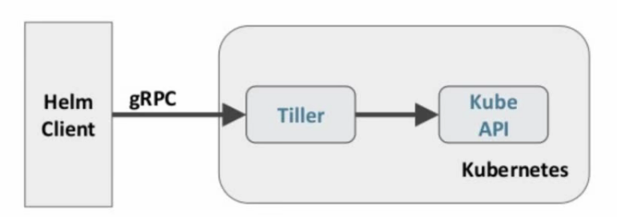

## 十、Helm

### 10.1 什么是 Helm

在没使用helm之前,向kubernetes部署应用，我们要依次部署deployment、svc 等步骤较繁琐。况且随着很多项目微服务化，复杂的应用在容器中部署以及管理显得较为复杂, helm通过打包的方式，支持发布的版本管理和控制，很大程度上简化了Kubernetes应用的部署和管理


Helm本质就是让K8s的应用管理(Deployment,Service 等)可配置,能动态生成。通过动态生成K8s资源清单文件(deployment.yaml, service.yaml) 。然后调用Kubectl自动执行K8s资源部署


Helm是官方提供的类似于YUM的包管理器,是部署环境的流程封装。Helm 有两个重要的概念: chart 和 release

* chart 是创建一个应用的信息集合,包括各种Kubernetes对象的配置模板、参数定义依赖关系文档说明等。chart 是应用部署的自包含逻辑单元。可以将chart想象成apt. yum 中的软件安装包
* release 是chart的运行实例，代表了一个正在运行的应用。当chart被安装到Kubernetes集群,就生成一个release。chart 能够多次安装到同-个集群，每次安装都是-个release


Helm包含两个组件: Helm 客户端和Tiller服务器，如下图所示



Helm客户端负责chart和release的创建和管理以及和Tiller的交互。Tiller 服务器运行在Kubernetes集群中，它会处理Helm客户端的请求,与Kubernetes API Server交互


### 10.2 Helm 部署

越来越多的公司和团队开始使用 Helm 这个 Kubernetes 的包管理器,我们也将使用 Helm 安装 Kubernetes 的常用组件。 Helm 由客户端命 helm 令行工具和服务端 tiller 组成,Helm 的安装十分简单。 下载 helm 命令行工具到master 节点 node1 的 /usr/local/bin 下,这里下载的 2.13. 1版本:

```shell
ntpdate ntp1.aliyun.com
wget https://mirrors.huaweicloud.com/helm/v2.13.1/helm-v2.13.1-linux-arm64.tar.gz
tar -zxvf helm-v2.13.1-linux-amd64.tar.gz
cd linux-amd64/
cp helm /usr/local/bin/
chmod a+x /usr/local/bin/helm

vim rbac.yaml
kubectl create -f rbac.yaml
helm init --service-account tiller --skip-refresh
docker pull gcr.io/kubernetes-helm/tiller:v2.13.1
```

为了安装服务端 tiller,还需要在这台机器上配置好 kubectl 工具和 kubeconfig 文件,确保 kubectl 工具可以在这台机器上访问 apiserver 且正常使用。 这里的 node1 节点以及配置好了 kubectl
因为 Kubernetes APIServer 开启了 RBAC 访问控制,所以需要创建 tiller 使用的 service account: tiller 并分配合适的角色给它。 详细内容可以查看helm文档中的 Role-based Access Control。 这里简单起见直接分配cluster- admin 这个集群内置的 ClusterRole 给它。创建 rbac-config.yaml 文件:

```yaml
apiVersion: v1
kind: ServiceAccount
metadata:
  name: tiller
  namespace: kube-system
---
apiVersion: rbac.authorization.k8s.io/v1beta1
kind: ClusterRoleBinding
metadata:
  name: tiller
roleRef:
  apiGroup: rbac.authorization.k8s.io
  kind: ClusterRole
  name: cluster-admin
subjects:
  - kind: ServiceAccount
    name: tiller
    namespace: kube-system
```


### 10.3 Helm 自定义模板

```shell
$ pwd # /home/helm

# 创建文件件
$ mkdir ./test
$ cd ./test

$ pwd # /home/helm/test/

# 创建自描述文件
$ cat <<EOF> Chart.yaml
name: hello-world
version: 1.0.0
EOF

# 创建模板文件, 用于生产 Kubernetes 资源清单 (mainfests)
$ mkdir ./templates
$ cat <<EOF> ./templates/deployment.yaml
apiVersion: extensions/v1beta1
kind: Deployment
metadata:
  name: hello-world
spec:
  replicas: 1
  template:
    metadata:
      labels:
        app: hello-world
    spec:
      containers:
        - name: hello-world
          image: hub.yyq.com/library/myapp:v1
          ports:
            - containerPort: 80
              protocol: TCP
EOF
$ cat <<EOF> ./templates/service.yaml
apiVersion: v1
kind: Service
metadata:
  name: hello-world
spec:
  type: NodePort
  ports:
    - port: 80
      targetPort: 80
      protocol: TCP
  selector:
    app: hello-world
EOF

$ pwd /home/helm/test/
$ helm install .
```


> helm chart 动态升级

```shell
$ pwd # /home/helm/test/

# 配置体现在配置文件 values.yaml
$ cat <<EOF> ./values.yaml
image:
  repository: hub.yyq.com/library/myapp
  tag: '2.0'
EOF

# 这个文件中定义的值，在模板文件中可以通过 .Values 对象访问到
$ cat <<EOF> ./templates/deployment.yaml
apiVersion: extensions/v1beta1
kind: Deployment
metadata:
  name: hello-world
spec:
  replicas: 1
  template:
    metadata:
      labels:
        app: hello-world
    spec:
      containers:
        - name: hello-world
          image: {{ .Values.image.repository }}:{{ .Values.image.tag }}
          ports:
            - containerPort: 80
              protocol: TCP
EOF

$ helm upgrade RELEASE_NAME . # 升级版本


$ helm upgrade RELEASE_NAME --set image.tag='v3' .

# 升级版本
helm upgrade -f values.yaml test .
```


> 基础命令

```shell
# 列出已经部署的 Release
$ helm ls
# 查询一个特定 Release 的状态
$ helm status RELEASE_NAME
# 移除所有与这个 Release 相关的 Kubernetes 资源
$ helm delete cautious-shrimp
$ helm rollback RELEASE_NAME REVISION_NUMBER
# 使用 helm delete --purge RELEASE_NAME 移除所有与指定 Release 相关的 Kubernetes 资源和所有这个 Release 的资源
$ helm delete --purge RELEASE_NAME
# 查看已删除的 Release
$ helm ls --deleted
```


> Debug

```shell
# 使用模板动态生成k8s资源清单，非常需要能提前预览生成的结果
# 使用  --dry-run --debug 选项来打印出生成的清单文件内容，而不执行部署
$ helm install --dry-run .
```


### 10.4 使用 Helm 部署 Dashboard

```shell
$ pwd # /usr/local/install-k8s/plugin/dashboard/kubernetes-dashboard
$ vim kubernetes-dashboard.yaml

$ helm install stable/kubernetes-dashboard \
-n kubernetes-dashboard \
--namespace kube-system \
-f kubernetes-dashboard.yaml

# 获取 kubernetes-dashboard-token 的 token-name
$ kubectl -n kube-system get secret | grep kubernetes-dashboard-token
# 解析并得到kubernetes-dashboard-token
$ kubectl describe secret token-name -n kube-system
```


**kubernetes-dashboard.yaml**

```yaml
image:
  repository: k8s.gcr.io/kubernetes-dashboard-amd64
  tag: v1.10.1
ingress:
  enabled: true
  hosts:
    - k8s.frognew.com
  annotations:
    nginx.ingress.kubernetes.io/ssl-redirect: "true"
    nginx.ingress.kubernetes.io/backend-protocol: "HTTPS"
  tls:
    - secretName: frognew-com-tls-secret
      hosts:
        - k8s.frognew.com
rbac:
  clusterAdminRole: true
```


### 10.5 使用 Helm 部署 Prometheus.md（普罗米修斯）


> 组件说明

1.**MetricServer**: 是kubernetes集群资源使用情况的聚合器,收集数据给kubernetes集群内使用,如kubectl,hpa,scheduler等。

2.**PrometheusOperator**: 是一个系统监测和警报工具箱,用来存储监控数据。

3.**NodeExporter**: 用于各node的关键度量指标状态数据。

4.**KubeStateMetrics**: 收集kubernetes集群内资源对象数据,制定告警规则。

5.**Prometheus**: 采用pull方式收集apiserver,scheduler,controller-manager,kubelet组件数据,通过http协议传输。

6.**Grafana**: 是可视化数据统计和监控平台。


#### 10.5.1 构建记录

```shell
$ mkdir prometheus
$ cd prometheus
$ pwd # /usr/local/install-k8s/plugin/prometheus

# 下载kube-prometheus
$ git clone https://github.com/coreos/kube-prometheus.git
$ cd /kube-prometheus/manifests

# 在 main node01 node02 下都导入prometheus需要的镜像
$ tar -zxvf prometheus.tar.gz
$ chmod a+x load-images.sh
$ ./load-images.sh

# 在宿主机中访问 192.168.137.10:30200 收集器地址
sum by (pod_name)( rate(container_cpu_usage_seconds_total{image!="", pod_name!=""}[1m]))

# 在宿主机中访问 192.168.137.10:30100 grrafana地址
```


**修改 grafana-service.yaml 文件，使用 nodepode 方式访问 grafana**

```yaml
apiVersion: v1
kind: Service
metadata:
  labels:
    app: grafana
  name: grafana
  namespace: monitoring
spec:
  type: NodePort
  ports:
  - name: http
    port: 3000
    targetPort: http
    nodePort: 30100
  selector:
    app: grafana
```

**修改 prometheus-service.yaml，改为 NodePort**

```yaml
apiVersion: v1
kind: Service
metadata:
  labels:
    prometheus: k8s
  name: prometheus-k8s
  namespace: monitoring
spec:
  type: NodePort
  ports:
  - name: web
    port: 9090
    targetPort: web
    nodePort: 30200
  selector:
    app: prometheus
    prometheus: k8s
  sessionAffinity: ClientIP
```


**修改 alertmanager-service.yaml，改为 NodePort**

```yaml
apiVersion: v1
kind: Service
metadata:
  labels:
    alertmanager: main
  name: alertmanager-main
  namespace: monitoring
spec:
  type: NodePort
  ports:
  - name: web
    port: 9093
    targetPort: web
    nodePort: 30300
  selector:
    alertmanager: main
    app: alertmanager
  sessionAffinity: ClientIP
```


#### 10.5.2 HPA控制器测试

```shell
$ kubectl run php-apache --image=gcr.io/google_containers/hpa-example --requests=cpu=200m --expose --port=80

#网络问题无法pull
$ docker tag gcr.io/google_containers/hpa-example:latest gcr.io/google_containers/hpa-example:v1
$ kubectl run php-apache --image=gcr.io/google_containers/hpa-example:v1 --requests=cpu=200m --expose --port=80

# 创建 HPA 控制器
$ kubectl autoscale deployment php-apache --cpu-percent=50 --min=1 --max=10

# 增加负载，查看负载节点数目
$ kubectl run -i --tty load-generator --image=busybox /bin/sh
$ while true; do wget -q -O- http://php-apache.default.svc.cluster.local; done
```


## 补充

### 资源限制 - Pod

Kubernetes对资源的限制实际上是通过cgroup来控制的，cgroup 是容器的一组用来控制内核如何运行进程的相关属性集合。针对内存、CPU 和各种设备都有对应的cgroup

默认情况下，Pod运行没有CPU和内存的限额。这意味着系统中的任何 Pod将能够像执行该Pod所在的节点一样，消耗足够多的CPU和内存。-般会针对某些应用的pod资源进行资源限制，这个资源限制是通过resources的requests和limits来实现

```yaml
spec:
  containers:
    - image: xxxx
      imagePullPolicy: Always
      name: auth
      ports:
        - containerPort: 8080
          protocol: TCP
      resources:
        limits:
          cpu: "4"
          memory: 2Gi
        requests:
          cpu: 250m
          memory: 250Mi
```

**requests 要分分配的资源, limits 为最高请求的资源值。可以简单理解为初始值和最大值**


### 资源限制 - 名称空间

> 一、计算资源配额

```yaml
apiVersion: v1
kind: ResourceQuota   # 资源配额
metadata:
  name: compute-resources   # 名称
  namespace: spark-cluster   # 名称空间
spec:
  hard:
    pods: "20"          # 能够创建的Pod数量
    requests.cpu: "20"    # 能够使用的requests cpu20个
    requests.memory: 100Gi  # 内存
    limits.cpu: "40"  
    limits.memory: 200Gi
```


> 二、配置对象**数量**配额限制

```yaml
apiVersion: v1
kind: ResourceQuota
metadata:
  name: object-counts
  namespace: spark-cluster
spec:
  hard:
    configmaps: "10"
    persistentvolumeclaims: "4"  # PVC
    replicationcontrollers: "20"    # RC
    secrets: "10"
    services: "10"
    services.loadbalancers: "2"  # 基于云服务器负载的方案
```


> 三、配置 CPU 和 内存 LimitRange

```yaml
apiVersion: v1
kind: LimitRange
metadata:
  name: mem-limit-range
spec:
  limits:
    - default:
        memory: 50Gi
        cpu: 5
      defaultRequest:
        memory: 1Gi
        cpu: 1
        type: Container
```

**default 即 limit 的值**

**defaultRequest 即 request 的值**

