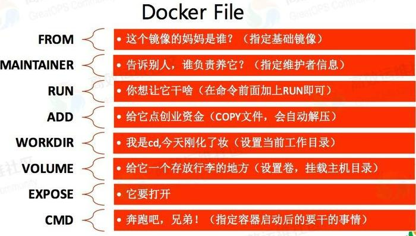
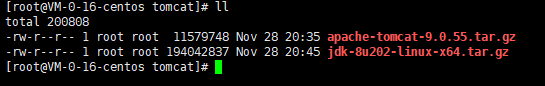

## Dockerfile

DockerFile 是用来构建 docker镜像文件的，命令参数脚本


构建步骤:

1. 编写一个Dockerfile文件
2. docker build 构建成为一个镜像
3. docker run 运行镜像
4. docker push 发布镜像(1. 公有库 docker hub  2. 私有库)


**基础知识**

1. 每一个关键字(指令)都是必须大写字母
2. 执行从上到下顺序执行
3. #表示注释
4. 每一个指令都会创建提交一个新的镜像层，并提交


> dockerfile是面向开发的，我们以后要发布项目，做镜像，就需要编写dockerfile文件，这个文件十分简单。
>
> Docker镜像逐渐成为企业交付的标准，必须掌握！

* DockerFile： 构建文件，定义一切的步骤，源代码
* DockerImages：通过DockerFile构建生成的镜像，最终发布和运行的产品，原来是jar war
* Docker容器：容器就是镜像运行起来提供服务


## Dockerfile指令

```shell
FROM			# 基础镜像，一切从这里开始构建
MAINTAINER		# 镜像是谁写的，姓名+邮箱
RUN				# 镜像构建的时候需要运行的命令
ADD				# 步骤，tomcat镜像，这个tomcat压缩包，添加内容
WORKDIR			# 镜像的默认工作目录
VOLUME			# 挂在卷
EXPOSE			# 指定暴露端口
CMD				# 容器启动后，要运行的命令。ps: 只有最后一个会生效，可被替代
ENTRYPOINT		# 容器启动后，要运行的命令。ps: 可以追加命令
ONBUILD			# 当构建一个被继承 DockerFile ，这个时候会运行 ONBULID 的直接，出发指令
COPY			# 类似ADD命令，将文件拷贝到镜像中
ENV				# 构建的时候，设置环境变量
```





## 实际测试

Docker Hub中，99%的镜像都是从这个基础镜像过来的 **FROM scratch**，然后再配置需要的软件和配置来进行构建

```shell
# 创建一个自己的centos

# 1. 编写Dockerfile文件
FROM centos
MAINTAINER coderGoo<869246700@qq.com>

ENV MYPATH /usr/local
WORKDIR $MYPATH

RUN yum -y install vim
RUN yum -y install net-tools

EXPOSE 80

CMD echo $MYPATH
CMD echo '-----end-----'
CMD "/bin/bash"

# 2. 构建镜像
# 命令 docker build -f dockerfile文件路径 -t 镜像名[:tag] .
[root@VM-0-16-centos dockerfile]# docker build -f dockerfile-centos -t mycentos .
Successfully built cc4e94dca7d7
Successfully tagged mycentos:latest

# 3. 运行构建完成的镜像
[root@VM-0-16-centos dockerfile]# docker run -it --name mycentos mycentos
```


## CMD 与 ENTRYPONIT 区别

**测试CMD**

```shell
## 编写 dockerfile 文件
[root@VM-0-16-centos dockerfile]# vim dockerfile-cmd-test 
FROM centos
CMD ["ls", "-a"]

# 构建镜像
[root@VM-0-16-centos dockerfile]# docker build -f dockerfile-cmd-test -t cmdtest .

# run运行，发现 ls -a 命令生效
[root@VM-0-16-centos dockerfile]# docker run cmdtest
.
..
.dockerenv
bin
dev
etc
home
lib
lib64
lost+found
media
mnt
opt
proc
root
run
sbin
srv
sys
tmp
usr

# 想追加一个命令 -l ls -al
[root@VM-0-16-centos dockerfile]# docker run cmdtest -l
docker: Error response from daemon: OCI runtime create failed: container_linux.go:380: starting container process caused: exec: "-l": executable file not found in $PATH: unknown.

# 用cmd的情况下， -l 替换了 CMD["ls", "-a"]命令， -l不是命令所以报错
```


**测试ENTRYPOINT**

```shell
# 我们追加命令，是直接拼接在我们的entrypoint后面的
[root@VM-0-16-centos dockerfile]# docker run entrypointtest  -l
total 56
drwxr-xr-x   1 root root 4096 Nov 28 12:23 .
drwxr-xr-x   1 root root 4096 Nov 28 12:23 ..
-rwxr-xr-x   1 root root    0 Nov 28 12:23 .dockerenv
lrwxrwxrwx   1 root root    7 Nov  3  2020 bin -> usr/bin
drwxr-xr-x   5 root root  340 Nov 28 12:23 dev
drwxr-xr-x   1 root root 4096 Nov 28 12:23 etc
drwxr-xr-x   2 root root 4096 Nov  3  2020 home
lrwxrwxrwx   1 root root    7 Nov  3  2020 lib -> usr/lib
lrwxrwxrwx   1 root root    9 Nov  3  2020 lib64 -> usr/lib64
drwx------   2 root root 4096 Sep 15 14:17 lost+found
drwxr-xr-x   2 root root 4096 Nov  3  2020 media
drwxr-xr-x   2 root root 4096 Nov  3  2020 mnt
drwxr-xr-x   2 root root 4096 Nov  3  2020 opt
dr-xr-xr-x 108 root root    0 Nov 28 12:23 proc
dr-xr-x---   2 root root 4096 Sep 15 14:17 root
drwxr-xr-x  11 root root 4096 Sep 15 14:17 run
lrwxrwxrwx   1 root root    8 Nov  3  2020 sbin -> usr/sbin
drwxr-xr-x   2 root root 4096 Nov  3  2020 srv
dr-xr-xr-x  13 root root    0 Nov 28 12:17 sys
drwxrwxrwt   7 root root 4096 Sep 15 14:17 tmp
drwxr-xr-x  12 root root 4096 Sep 15 14:17 usr
drwxr-xr-x  20 root root 4096 Sep 15 14:17 var

[root@VM-0-16-centos dockerfile]# docker run entrypointtest ls -al
ls: cannot access 'ls': No such file or directory
```


## 实战 Tomcat 镜像

1. 准备镜像文件 tomcat压缩包、jdk压缩包

​	


2. 编写dockerfile文件，官方命名 `Dockerfile`，build的时候会自动寻找这个文件，就不需要-f指定了

   ```shell
   FROM centos
   MAINTAINER goo<869246700@qq.com>
   
   COPY readme.txt /usr/local/readme.txt
   # ADD命令自动解压
   ADD jdk-8u11-linux-x64.tar.gz /usr/local/
   ADD apache-tomcat-9.0.22.tar.gz /usr/local/
   
   RUN yum -y install vim
   
   ENV MYPATH /usr/local
   WORKDIR $MYPATH
   
   ENV JAVA_HOME /usr/local/jdk1.8.0_11
   ENV CLASSPATH $JAVA_HOME/lib/dt.jar:$JAVA_HOME/lib/tools.jar
   ENV CATALINA_HOME /usr/local/apache-tomcat-9.0.22
   ENV CATALINE_BASH /usr/local/apache-tomcat-9.0.22
   ENV PATH $PATH:$JAVA_HOME/bin:$CATALINA_HOME/lib:$CATALINA_HOME/bin
   
   EXPOSE 8080
   
   CMD /usr/local/apache-tomcat-9.0.22/bin/startup.sh && tail -F /usr/local/apache-tomcat-9.0.22/logs/catalina.out
   ```

   

3. 构建镜像

   ```shell
   # 执行命令
   docker bulid -t goo-tomcat .
   
   # 执行过程
   [root@VM-0-16-centos tomcat]# docker build -t goo-tomcat .
   ```

4. 启动镜像

   ```shell
   docker run -d -p 9090:8080 --name tomcat -v /home/tomcat/test:/usr/local/apache-tomcat-9.0.22/webapps/test -v /home/tomcat/logs/:/usr/local/apache-tomcat-9.0.22/logs goo-tomcat
   
   [root@VM-0-16-centos tomcat]# docker run -d -p 9090:8080 --name tomcat -v /home/tomcat/test:/usr/local/apache-tomcat-9.0.22/webapps/test -v /home/tomcat/logs/:/usr/local/apache-tomcat-9.0.22/logs goo-tomcat
   ```

5. 访问测试

6. 发布项目(由于做了卷挂载，我们直接可以发布项目)

   ```xml
   <?xml version="1.0" encoding="UTF-8"?>
   <web-app xmlns="http://xmlns.jcp.org/xml/ns/javaee" 
            xmlns:xsi="http://www.w3.org/2001/XMLSchema-instance"
            xsi:schemaLocation="http://xmlns.jcp.org/xml/ns/javaee
            http://xmlns.jcp.org/xml/ns/javaee/web-app_3_1.xsd"
            version="3.1">
           
   </web-app>
   ```

   ```jsp
   <%@ page language="java" contentType="text/html; charset=UTF-8"
       pageEncoding="UTF-8"%>
   <!DOCTYPE html>
   <html>
   <head>
   <meta charset="utf-8">
   <title>Goo</title>
   </head>
   <body>
   <p>
    Hello CoderGoo!
   </p>
   
   <%
     System.out.println("----goo tomcat logs----");
   %>
   </body> 
   </html> 
   ```


## 镜像发布Docker Hub

1. 注册账号 [Docker Hub]( https://hub.docker.com/)

2. 确定账号可以登录

3. 在服务器上提交自己的镜像

   ```shell
   [root@VM-0-16-centos ~]# docker login --help 
   
   Usage:  docker login [OPTIONS] [SERVER]
   
   Log in to a Docker registry.
   If no server is specified, the default is defined by the daemon.
   
   Options:
     -p, --password string   Password
         --password-stdin    Take the password from stdin
     -u, --username string   Username
   ```

4. 登录完毕之后就可以提交镜像

   ```shell
   [root@VM-0-16-centos ~]# docker login -u a869246700
   Password: 
   WARNING! Your password will be stored unencrypted in /root/.docker/config.json.
   Configure a credential helper to remove this warning. See
   https://docs.docker.com/engine/reference/commandline/login/#credentials-store
   
   Login Succeeded
   
   
   [root@VM-0-16-centos ~]# docker push goo-tomcat
   Using default tag: latest
   The push refers to repository [docker.io/library/goo-tomcat]
   399717c20fa2: Preparing 
   462acf452b31: Preparing 
   6a27f0d55ccd: Preparing 
   25ecd6a508b5: Preparing 
   74ddd0ec08fa: Preparing 
   denied: requested access to the resource is denied # 被拒绝
   
   # 使用 docker tag source target 改成我们docker hub 用户名的tag
   [root@VM-0-16-centos ~]# docker tag goo-tomcat:latest a869246700/goo-tomcat:latest
   ```


## 镜像发布 阿里云

1. 登录阿里云
2. 找到容器镜像服务
3. 创建命名空间
4. 创建容器镜像
