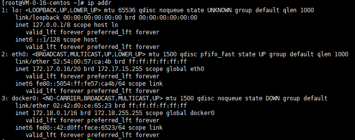
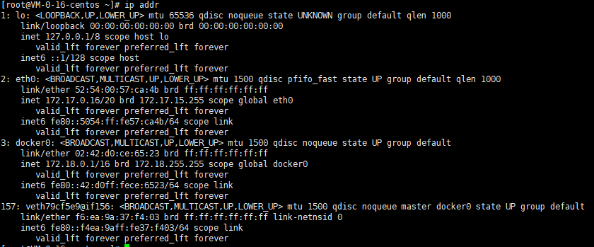
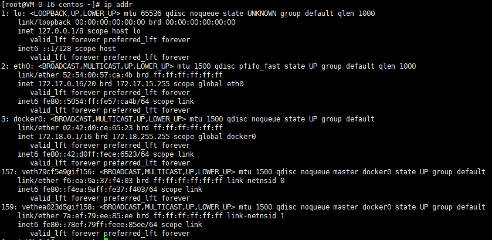
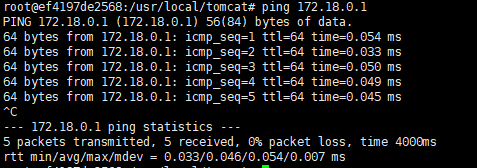
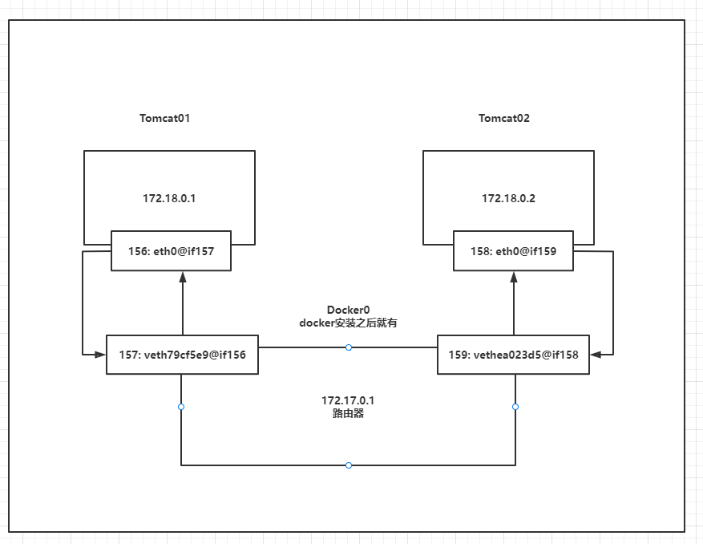
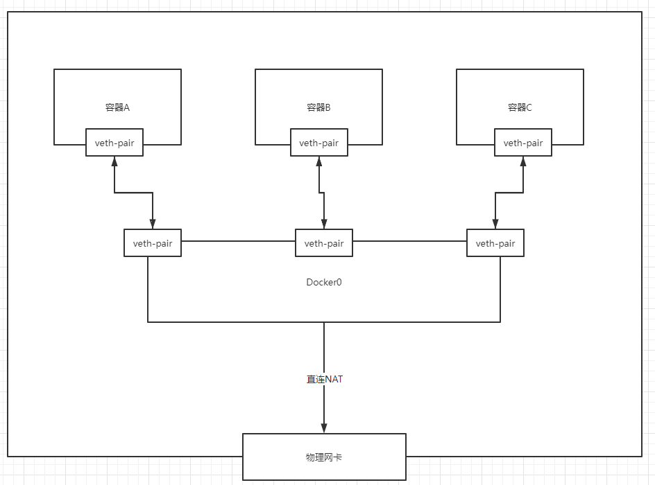

## Docker网络

### 理解Docker网络	Docker0

首先需要清空所有环境


> 测试




有三个网络

```shell
# 问题，docker是如何处理容器网络访问的？

# 查看容器内部的网络地址 ip addr
[root@VM-0-16-centos ~]# docker exec  -it tomcat ip addr
1: lo: <LOOPBACK,UP,LOWER_UP> mtu 65536 qdisc noqueue state UNKNOWN group default qlen 1000
    link/loopback 00:00:00:00:00:00 brd 00:00:00:00:00:00
    inet 127.0.0.1/8 scope host lo
       valid_lft forever preferred_lft forever
156: eth0@if157: <BROADCAST,MULTICAST,UP,LOWER_UP> mtu 1500 qdisc noqueue state UP group default 
    link/ether 02:42:ac:12:00:02 brd ff:ff:ff:ff:ff:ff link-netnsid 0
    inet 172.18.0.2/16 brd 172.18.255.255 scope global eth0
       valid_lft forever preferred_lft forever


# 思考，linux系统能不能ping通容器内部
[root@VM-0-16-centos ~]# ping 172.18.0.2
PING 172.18.0.2 (172.18.0.2) 56(84) bytes of data.
64 bytes from 172.18.0.2: icmp_seq=1 ttl=64 time=0.067 ms
64 bytes from 172.18.0.2: icmp_seq=2 ttl=64 time=0.054 ms
64 bytes from 172.18.0.2: icmp_seq=3 ttl=64 time=0.062 ms

# linux可以ping通docker容器内部
```

> 原理: 

1.我们启动一个docker容器，docker就会给容器分配一个ip，我们只要安装了docker，就会有一个网卡docker0

桥接模式，使用的技术是 veth-pair

再次查看linux的网卡



2.再次新建一个容器测试，发现又多一对网卡



```shell
# 我们发现这个容器带来网卡，都是成对的
# veth-pair 是成对出现的一种虚拟网络设备接口，一端连着网络协议栈，一端彼此相连
# 正因为有这个特性：evth-pair 充当一个桥梁，链接着各种虚拟网络设备
```

3.我们来测试一下tomcat与tomcat02能否相互ping通

```shell
docker run -it tomcat02 /bin/bash
ping 172.18.0.1
# 结论：容器与容器之间是可以相互ping通的
```





> 结论

绘制一个网络模型图



Tomcat01 与 Tomcat02 是公用的一个路由器，docker0

所有容器不指定网络的情况下，都是docker0路由的，docker会给我们的容器分配一个默认可用的ip


> 小结

1.Docker 使用的是Linux的桥接，通过veth-pair技术，宿主机中的一个Docker容器的网桥，docker0




2.Docker 中的所有网络接口都是虚拟的，虚拟的转发效率高！（内网传递）

3.只要Docker容器被删除，对应网桥就没了


### 容器互联 --link

> 思考一个场景，我们编写了一个微服务，database url=ip，项目不重启，数据库ip换掉，我们希望可以处理这个问题，可以用名字来进行访问容器？


```shell
[root@VM-0-16-centos ~]# docker exec -it tomcat ping tomcat02 
ping: tomcat02: Name or service not known

# 如何能够解决？
[root@VM-0-16-centos ~]# docker run -d -P --name tomcat03 --link tomcat02 tomcat
c73f3402af231dfc8f951e040ea553eca741ee17b300691453ff1465cb6391c0

# 通过--link就可以解决网络连通问题
[root@VM-0-16-centos ~]# docker exec -it tomcat02 ping tomcat01
PING tomcat01 (172.18.0.2) 56(84) bytes of data.
64 bytes from tomcat01 (172.18.0.2): icmp_seq=1 ttl=64 time=0.066 ms
64 bytes from tomcat01 (172.18.0.2): icmp_seq=2 ttl=64 time=0.068 ms
64 bytes from tomcat01 (172.18.0.2): icmp_seq=3 ttl=64 time=0.069 ms
64 bytes from tomcat01 (172.18.0.2): icmp_seq=4 ttl=64 time=0.068 ms

# 反向可以ping通吗？ - 不可以
[root@VM-0-16-centos ~]# docker exec -it tomcat01 ping tomcat02
ping: tomcat02: Name or service not known

# 其实这个tomcat02就是在本地配置了tomcat01的配置？
# 查看tomcat02的hosts文件
[root@VM-0-16-centos ~]# docker exec -it tomcat02 cat /etc/hosts
127.0.0.1	localhost
::1	localhost ip6-localhost ip6-loopback
fe00::0	ip6-localnet
ff00::0	ip6-mcastprefix
ff02::1	ip6-allnodes
ff02::2	ip6-allrouters
172.18.0.2	tomcat01 b3e1372df07e
172.18.0.3	eff95237ced8

```

> 我么现在Docker已经不建议使用 --link 了
>
> 需要使用自定义网络，不适用 docker0
>
> docker0问题，他不支持容器名链接访问


### 自定义网络

> 查看所有docker网络 `docker network ls`

```shell
[root@VM-0-16-centos ~]# docker network ls
NETWORK ID     NAME      DRIVER    SCOPE
2b4d4ca6eff3   bridge    bridge    local
6740be591843   host      host      local
a28e80859adc   none      null      local

```

**网络模式**

brige：桥接模式

none：不配置网络

host：和宿主机共享网络

container：容器内网络连通


> docker0的特点

* 默认，域名不能访问
* 需要通过--link进行域名配置

**测试**

```shell
# 我们直接启动的命令 --net bridge，而这个是我们的dokcer0
[root@VM-0-16-centos ~]# docker run -d -P --name tomcat01 tomcat
[root@VM-0-16-centos ~]# docker run -d -P --name tomcat01 --net bridge tomcat
```


**自定义网络**

```shell
# 我们自定义一个网络
--driver bridge # 设置为桥接模式
--subnet 192.168.0.0/16 # 设置子网
gateway 192.168.0.1 # 设置网关

[root@VM-0-16-centos ~]# docker network create --driver bridge --subnet 192.168.0.0/16 --gateway 192.168.0.1 mynet

[root@VM-0-16-centos ~]# docker network ls
NETWORK ID     NAME      DRIVER    SCOPE
2b4d4ca6eff3   bridge    bridge    local
6740be591843   host      host      local
f9746ae3f56a   mynet     bridge    local
a28e80859adc   none      null      local


# 自己的网络就创建好了
[root@VM-0-16-centos ~]# docker network inspect mynet 
[
    {
        "Name": "mynet",
        "Id": "f9746ae3f56a8d01f467d8026ca102f05b3b38f90f72c1abfff78a14a078b334",
        "Created": "2021-12-03T15:44:34.31550662+08:00",
        "Scope": "local",
        "Driver": "bridge",
        "EnableIPv6": false,
        "IPAM": {
            "Driver": "default",
            "Options": {},
            "Config": [
                {
                    "Subnet": "192.168.0.0/16",
                    "Gateway": "192.168.0.1"
                }
            ]
        },
        "Internal": false,
        "Attachable": false,
        "Ingress": false,
        "ConfigFrom": {
            "Network": ""
        },
        "ConfigOnly": false,
        "Containers": {},
        "Options": {},
        "Labels": {}
    }
]

# 再次测试ping链接
[root@VM-0-16-centos ~]# docker exec -it tomcat-net-01 ping 192.168.0.2
PING 192.168.0.2 (192.168.0.2) 56(84) bytes of data.
64 bytes from 192.168.0.2: icmp_seq=1 ttl=64 time=0.033 ms
64 bytes from 192.168.0.2: icmp_seq=2 ttl=64 time=0.046 ms
64 bytes from 192.168.0.2: icmp_seq=3 ttl=64 time=0.035 ms
64 bytes from 192.168.0.2: icmp_seq=4 ttl=64 time=0.038 ms

# 现在不适用 --link 也可以ping名字了
[root@VM-0-16-centos ~]# docker exec -it tomcat-net-01 ping tomcat-net-02
PING tomcat-net-02 (192.168.0.3) 56(84) bytes of data.
64 bytes from tomcat-net-02.mynet (192.168.0.3): icmp_seq=1 ttl=64 time=0.070 ms
64 bytes from tomcat-net-02.mynet (192.168.0.3): icmp_seq=2 ttl=64 time=0.057 ms
64 bytes from tomcat-net-02.mynet (192.168.0.3): icmp_seq=3 ttl=64 time=0.057 ms
```

我们自定义的网络docker都已经帮我们维护好了对应的关系，推荐我们平时是这样使用网络！

优点：

* 不同的集群使用不同的网络，保证集群是安全健康的


```shell
apt update
apt install -y iputils-ping
apt install -y iproute2
apt install -y net-tools
```


### 网络连通

```shell
# 测试不同网络的容器下，是否可以ping通
[root@VM-0-16-centos ~]# docker exec  -it tomcat01 ping tomcat-net-01
ping: tomcat-net-01: Name or service not known


# 容器连通网络
[root@VM-0-16-centos ~]# docker network connect mynet tomcat01

# 连通之后，就是将tomcat01加入到mynet中
[root@VM-0-16-centos ~]# docker network inspect mynet 
[
    {
        "Name": "mynet",
        "Id": "f9746ae3f56a8d01f467d8026ca102f05b3b38f90f72c1abfff78a14a078b334",
        "Created": "2021-12-03T15:44:34.31550662+08:00",
        "Scope": "local",
        "Driver": "bridge",
        "EnableIPv6": false,
        "IPAM": {
            "Driver": "default",
            "Options": {},
            "Config": [
                {
                    "Subnet": "192.168.0.0/16",
                    "Gateway": "192.168.0.1"
                }
            ]
        },
        "Internal": false,
        "Attachable": false,
        "Ingress": false,
        "ConfigFrom": {
            "Network": ""
        },
        "ConfigOnly": false,
        "Containers": {
            "44c07a12868d0c4b0e287de4c8bed02981b0d94dc178c34c6e5cd340b9477adb": {
                "Name": "tomcat-net-01",
                "EndpointID": "c84b34c794f8f3b89243694d8f14ab5d1a0b58e8f433b0c0db447ec7609b0809",
                "MacAddress": "02:42:c0:a8:00:02",
                "IPv4Address": "192.168.0.2/16",
                "IPv6Address": ""
            },
            "6cf316c75d44b21f9c8820b876236dfe32d85c7ec984fb4dd48c67a64207bc6a": {
                "Name": "tomcat-net-02",
                "EndpointID": "ff8651bd611c18a7cf1af048e61e2733f52dce45f382367c3daf93620f0956e7",
                "MacAddress": "02:42:c0:a8:00:03",
                "IPv4Address": "192.168.0.3/16",
                "IPv6Address": ""
            },
            "8d26b8727d291e0ffa8349e584d368d7654624766730a69960e41f7554215534": {
                "Name": "tomcat01",
                "EndpointID": "2c7e9f1a22247a8a6eec43278e61f4de9a135cbeadfd718793b1823dd45fdfa6",
                "MacAddress": "02:42:c0:a8:00:04",
                "IPv4Address": "192.168.0.4/16",
                "IPv6Address": ""
            }
        },
        "Options": {},
        "Labels": {}
    }
]

# 就可以ping通了
[root@VM-0-16-centos ~]# docker exec  -it tomcat01 ping tomcat-net-01
PING tomcat-net-01 (192.168.0.2) 56(84) bytes of data.
64 bytes from tomcat-net-01.mynet (192.168.0.2): icmp_seq=1 ttl=64 time=0.070 ms
64 bytes from tomcat-net-01.mynet (192.168.0.2): icmp_seq=2 ttl=64 time=0.078 ms
64 bytes from tomcat-net-01.mynet (192.168.0.2): icmp_seq=3 ttl=64 time=0.076 ms
```

> 结论：假设要跨网络操作别人，就需要使用`docker network connect`进行连通


### 实战 部署Redis集群

1. 创建Redis网卡

   > docker network create redis --subnet 172.38.0.0/16

2. 通过脚本创建6个redis配置

   ```shell
   for port in $(seq 1 6); \
   do \
   mkdir -p /mydata/redis/node-${port}/conf
   touch /mydata/redis/node-${port}/conf/redis.conf
   cat << EOF >/mydata/redis/node-${port}/conf/redis.conf
   port 6379
   bind 0.0.0.0
   cluster-enabled yes
   cluster-config-file nodes.conf
   cluster-node-timeout 5000
   cluster-announce-ip 172.38.0.1${port}
   cluster-announce-port 6379
   cluster-announce-bus-port 16379
   appendonly yes
   EOF
   done
   ```

3. 创建对应的docker容器

   ```shell
   docker run -p 6371:6379 -p 16371:16379 --name redis-1 \
   -v /mydata/redis/node-1/data:/data \
   -v /mydata/redis/node-1/conf/redis.conf:/etc/redis/redis.conf \
   -d --net redis-net --ip 172.38.0.11 redis:5.0.9-alpine3.11 redis-server /etc/redis/redis.conf
   
   docker run -p 6372:6379 -p 16372:16379 --name redis-2 \
   -v /mydata/redis/node-2/data:/data \
   -v /mydata/redis/node-2/conf/redis.conf:/etc/redis/redis.conf \
   -d --net redis-net --ip 172.38.0.12 redis:5.0.9-alpine3.11 redis-server /etc/redis/redis.conf
   
   docker run -p 6373:6379 -p 16373:16379 --name redis-3 \
   -v /mydata/redis/node-3/data:/data \
   -v /mydata/redis/node-3/conf/redis.conf:/etc/redis/redis.conf \
   -d --net redis-net --ip 172.38.0.13 redis:5.0.9-alpine3.11 redis-server /etc/redis/redis.conf
   
   docker run -p 6374:6379 -p 16374:16379 --name redis-4 \
   -v /mydata/redis/node-4/data:/data \
   -v /mydata/redis/node-4/conf/redis.conf:/etc/redis/redis.conf \
   -d --net redis-net --ip 172.38.0.14 redis:5.0.9-alpine3.11 redis-server /etc/redis/redis.conf
   
   docker run -p 6375:6379 -p 16375:16379 --name redis-5 \
   -v /mydata/redis/node-5/data:/data \
   -v /mydata/redis/node-5/conf/redis.conf:/etc/redis/redis.conf \
   -d --net redis-net --ip 172.38.0.15 redis:5.0.9-alpine3.11 redis-server /etc/redis/redis.conf
   
   docker run -p 6376:6379 -p 16376:16379 --name redis-6 \
   -v /mydata/redis/node-6/data:/data \
   -v /mydata/redis/node-6/conf/redis.conf:/etc/redis/redis.conf \
   -d --net redis-net --ip 172.38.0.16 redis:5.0.9-alpine3.11 redis-server /etc/redis/redis.conf
   ```

4. 创建集群

   ```shell
   /data # redis-cli --cluster create 172.38.0.11:6379 172.38.0.12:6379 172.38.0.13:6379 172.38.0.14:6379 172.38.0.15:6379 172.38.0.16:6379 --cluster-rep
   licas 1
   >>> Performing hash slots allocation on 6 nodes...
   Master[0] -> Slots 0 - 5460
   Master[1] -> Slots 5461 - 10922
   Master[2] -> Slots 10923 - 16383
   Adding replica 172.38.0.15:6379 to 172.38.0.11:6379
   Adding replica 172.38.0.16:6379 to 172.38.0.12:6379
   Adding replica 172.38.0.14:6379 to 172.38.0.13:6379
   M: f96d471cb05a1c1674e5b987299408d58c1c3f5c 172.38.0.11:6379
      slots:[0-5460] (5461 slots) master
   M: 6c02a6008803965ee902eefd27c09e6268acbfd5 172.38.0.12:6379
      slots:[5461-10922] (5462 slots) master
   M: afc55077012fb56a0ee0a8bb1d9d1da3a84625ec 172.38.0.13:6379
      slots:[10923-16383] (5461 slots) master
   S: f6bd4056aad0b716c0af1d409ab313d7868368cc 172.38.0.14:6379
      replicates afc55077012fb56a0ee0a8bb1d9d1da3a84625ec
   S: 55fbe904ba9e703e300cbf639df7fe243fdbc4c8 172.38.0.15:6379
      replicates f96d471cb05a1c1674e5b987299408d58c1c3f5c
   S: 80b1dc65bffc0ff4a25e1b0d747d0424990db229 172.38.0.16:6379
      replicates 6c02a6008803965ee902eefd27c09e6268acbfd5
   Can I set the above configuration? (type 'yes' to accept): yes
   >>> Nodes configuration updated
   >>> Assign a different config epoch to each node
   >>> Sending CLUSTER MEET messages to join the cluster
   Waiting for the cluster to join
   ..
   >>> Performing Cluster Check (using node 172.38.0.11:6379)
   M: f96d471cb05a1c1674e5b987299408d58c1c3f5c 172.38.0.11:6379
      slots:[0-5460] (5461 slots) master
      1 additional replica(s)
   S: 80b1dc65bffc0ff4a25e1b0d747d0424990db229 172.38.0.16:6379
      slots: (0 slots) slave
      replicates 6c02a6008803965ee902eefd27c09e6268acbfd5
   M: afc55077012fb56a0ee0a8bb1d9d1da3a84625ec 172.38.0.13:6379
      slots:[10923-16383] (5461 slots) master
      1 additional replica(s)
   S: f6bd4056aad0b716c0af1d409ab313d7868368cc 172.38.0.14:6379
      slots: (0 slots) slave
      replicates afc55077012fb56a0ee0a8bb1d9d1da3a84625ec
   S: 55fbe904ba9e703e300cbf639df7fe243fdbc4c8 172.38.0.15:6379
      slots: (0 slots) slave
      replicates f96d471cb05a1c1674e5b987299408d58c1c3f5c
   M: 6c02a6008803965ee902eefd27c09e6268acbfd5 172.38.0.12:6379
      slots:[5461-10922] (5462 slots) master
      1 additional replica(s)
   [OK] All nodes agree about slots configuration.
   >>> Check for open slots...
   >>> Check slots coverage...
   [OK] All 16384 slots covered.
   ```

5. 测试集群

   ```shell
   127.0.0.1:6379> set name "coderGoo"
   -> Redirected to slot [5798] located at 172.38.0.12:6379
   OK
   127.0.0.1:6379> get name
   -> Redirected to slot [5798] located at 172.38.0.16:6379
   "coderGoo"
   172.38.0.16:6379> CLUSTER NODES
   afc55077012fb56a0ee0a8bb1d9d1da3a84625ec 172.38.0.13:6379@16379 master - 0 1638709720000 3 connected 10923-16383
   55fbe904ba9e703e300cbf639df7fe243fdbc4c8 172.38.0.15:6379@16379 slave f96d471cb05a1c1674e5b987299408d58c1c3f5c 0 1638709720000 1 connected
   80b1dc65bffc0ff4a25e1b0d747d0424990db229 172.38.0.16:6379@16379 myself,master - 0 1638709717000 7 connected 5461-10922
   f96d471cb05a1c1674e5b987299408d58c1c3f5c 172.38.0.11:6379@16379 master - 0 1638709720000 1 connected 0-5460
   f6bd4056aad0b716c0af1d409ab313d7868368cc 172.38.0.14:6379@16379 slave afc55077012fb56a0ee0a8bb1d9d1da3a84625ec 0 1638709720571 4 connected
   6c02a6008803965ee902eefd27c09e6268acbfd5 172.38.0.12:6379@16379 master,fail - 1638709606806 1638709605200 2 connected
   ```

> 我们使用docker技术之后，所有的技术都会慢慢变得简单起来