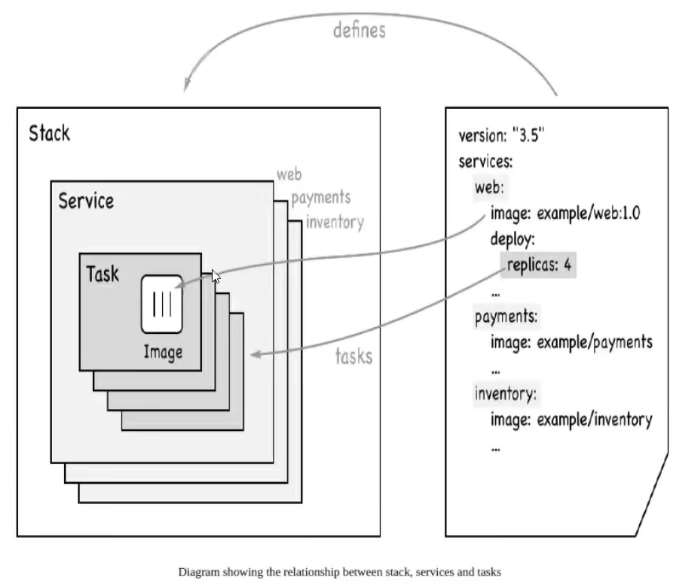

# Docker-Swarm

## 1. 入门

> 帮助命令 `docker swarm --help`

```shell
[root@VM-0-16-centos ~]# docker swarm --help

Usage:  docker swarm COMMAND

Manage Swarm

Commands:
  ca          Display and rotate the root CA
  init        Initialize a swarm
  join        Join a swarm as a node and/or manager
  join-token  Manage join tokens
  leave       Leave the swarm
  unlock      Unlock swarm
  unlock-key  Manage the unlock key
  update      Update the swarm
```


> 初始化swarm `docker swarm init`

```shell
[root@VM-0-16-centos ~]# docker swarm init --help

Usage:  docker swarm init [OPTIONS]

Initialize a swarm

Options:
      --advertise-addr string                  Advertised address (format: <ip|interface>[:port])
      --autolock                               Enable manager autolocking (requiring an unlock key
                                               to start a stopped manager)
      --availability string                    Availability of the node ("active"|"pause"|"drain")
                                               (default "active")
      --cert-expiry duration                   Validity period for node certificates
                                               (ns|us|ms|s|m|h) (default 2160h0m0s)
      --data-path-addr string                  Address or interface to use for data path traffic
                                               (format: <ip|interface>)
      --data-path-port uint32                  Port number to use for data path traffic (1024 -
                                               49151). If no value is set or is set to 0, the
                                               default port (4789) is used.
      --default-addr-pool ipNetSlice           default address pool in CIDR format (default [])
      --default-addr-pool-mask-length uint32   default address pool subnet mask length (default 24)
      --dispatcher-heartbeat duration          Dispatcher heartbeat period (ns|us|ms|s|m|h) (default 5s)
      --external-ca external-ca                Specifications of one or more certificate signing
                                               endpoints
      --force-new-cluster                      Force create a new cluster from current state
      --listen-addr node-addr                  Listen address (format: <ip|interface>[:port])
                                               (default 0.0.0.0:2377)
      --max-snapshots uint                     Number of additional Raft snapshots to retain
      --snapshot-interval uint                 Number of log entries between Raft snapshots (default
                                               10000)
      --task-history-limit int                 Task history retention limit (default 5)
```


> 创建一个swarm `docker swarm init --advertise-addr`

```shell
[root@VM-0-16-centos ~]# docker swarm init --advertise-addr 172.17.0.16
Swarm initialized: current node (e477py8hj9jdk5dx26h5uvgh5) is now a manager.

To add a worker to this swarm, run the following command:

    docker swarm join --token SWMTKN-1-3jtxl1iv14b2ad5c8rmocav3gy9sik9cmiokzxlw1zcno2cfji-6gjjrbmxuo4r78w12cshen6be 172.17.0.16:2377

To add a manager to this swarm, run 'docker swarm join-token manager' and follow the instructions.
```


> 加入一个节点 `docker swarm join --token`

```shell
[root@VM-0-16-centos ~]# docker swarm join --token SWMTKN-1-3jtxl1iv14b2ad5c8rmocav3gy9sik9cmiokzxlw1zcno2cfji-6gjjrbmxuo4r78w12cshen6be 172.17.0.16:2377xxxxxxxxxx [root@VM-0-16-centos ~]# docker swarm join --token SWMTKN-1-3jtxl1iv14b2ad5c8rmocav3gy9sik9cmiokzxlw1zcno2cfji-6gjjrbmxuo4r78w12cshen6be 172.17.0.16:2377docker swarm join --token SWMTKN-1-3jtxl1iv14b2ad5c8rmocav3gy9sik9cmiokzxlw1zcno2cfji-6gjjrbmxuo4r78w12cshen6be 172.17.0.16:2377
```


## 2. Raft协议

双主双从：假设一个节点挂了，其他节点是否可以用？

> Raft的核心：保证大多数节点存活可用。（n>1），所以测试时，集群至少大于三台

**集群为了保证可用，至少要保证3个主节点，随时要保证两个主节点存活**


## 3. Swarm集群

```shell
[root@VM-0-16-centos ~]# docker service create -p 8888:80 --name my-nginx nginx
```


> docker run 容器启动，不具有扩缩容器
>
> docker service 服务！具有扩缩容器，滚动更新


> 查看服务 `docker service ps xxx` `docker service ls`


> 动态扩缩容 
>
> 方式一: `docker service update --replicas num service-name`
>
> 方式二:`docker service scale service-name=num`


**服务，集群中任意的节点都可以访问。服务可以有多个副本动态扩缩容，实现高可用**

`弹性` `扩缩容`


## 4. 概念总结

**Swarm**

集群的管理和编排，docker可以初始化一个 swarm 集群，其他节点可以加入。（管理者、工作者）

**Node**

就是一个 docker 节点，多个节点就组成一个网络集群。（管理、工作者）

**Service**

服务，可以在管理节点或工作节点中运行。


**Task**

容器内的命令，细节任务。



