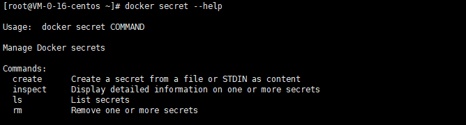
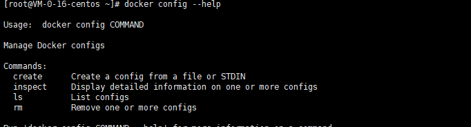

##  Docker Stack

**docker-compose** 单机部署项目

**docker stack** 集群部署项目

```shell
# 单机
docker-compose up -d wordpress.yaml
# 集群
docker stack deploy wordpress.yaml

```


## Docker Secret

安全，配置密码，证书！




## Docker Config

配置



